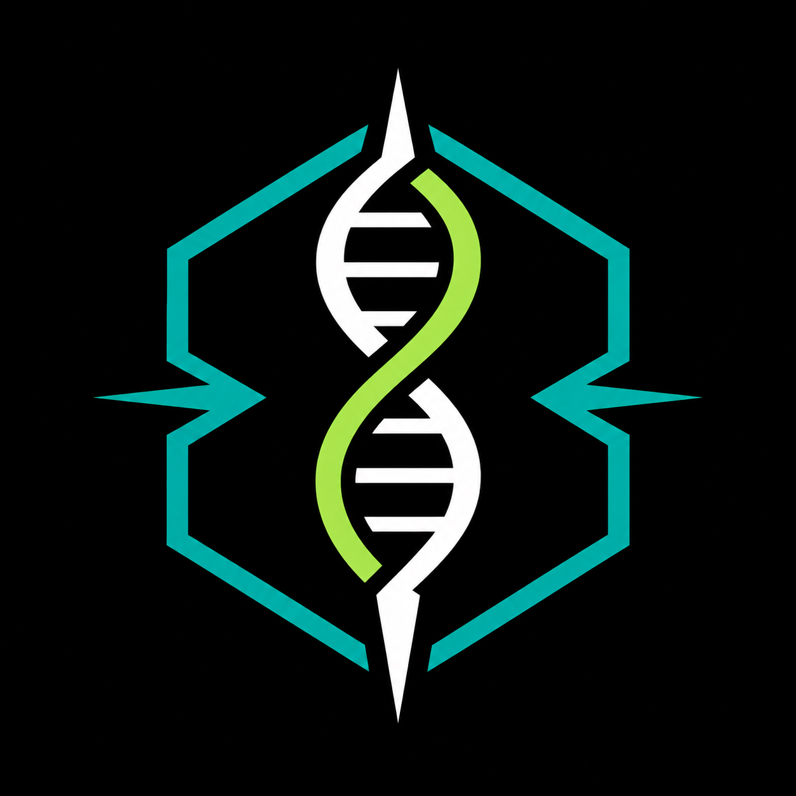

# Anomalie



## Wojna

Gazy bojowe rozlane nad przedpolami miast wsiąkły w glebę i osiadły na dnie rzek. Wirusy wypuszczone w ramach operacji, które oficjalnie nigdy nie istniały, krążyły po powietrzu długo po tym jak polityczni decydenci ukryli się w swoich bunkrach. Ciężka artyleria nie rozróżniała między celem wojskowym, a elektrowniami chłodzonymi wodą gruntową - ich reaktory, rozerwane w wyniku ostrzału, rozlały się bezgłośnie przez dziesiątki mil. Składy chemiczne, laboratoria, rafinerie - wszystko to stało się bombami zegarowymi, których nikt nie rozbroił, bo nikt nie miał już na to czasu ani ochoty.

Kiedy zombie rozrywały kolejne rodziny wzrok całego świata skierował się na zagrożenie biologiczne, nikt nie zadał pytania oczywistego: co stanie się, gdy nowy wróg zacznie przemierzać świat, który człowiek zatruje i napromieniuje? Odpowiedź przyszła sama. I nie była subtelna.

## Operacja Słoneczny Deszcz

Decyzja zapadła w ostatnich dniach stycznia 2029 roku, w ciszy sali konferencyjnej głęboko pod powierzchnią ziemi. Mapy na ścianach były czerwone na południu i wschodnim wybrzeżu - kolor aktywnych skupisk hordy. Generałowie stojący przed nimi wiedzieli, że to już nie bitwa o miasta. Traktowali to jak arytmetyka przetrwania narodu bo żaden z nich jeszcze w swej naiwności nie był złamany na tyle by rozpatrywać to w kontekście gatunku. Operację nazwano *Słoneczny Deszcz*.

Seria taktycznych głowic nuklearnych miała spaść na najgęstsze skupiska zainfekowanych. Matematyka była prosta, argumenty - pozornie nie do obalenia. Komisja zatwierdziła. Rozkaz wysłano, a wtedy horda się rozeszła.

Nikt nie wie jak to się stało. Analitycy w zapełnionych salach operacyjnych patrzyli na ekrany z coraz mniejszym zrozumieniem - skupiska, które liczyły setki tysięcy osobników, nagle zaczęły się rozpraszać na godziny przed zaplanowanym uderzeniem. Pojedyncze sylwetki rozchodziły się w różnych kierunkach, wchodziły między drzewa, zanurzały się w rzekach, wspinały na wzgórza. Jakby każdy z nich, pozbawiony świadomości i instynktu samozachowawczego, nagle go odzyskał i podjął decyzję o ucieczce.

Ale uciekali tylko po to, by wrócić. Alphy nie wiedziały jak długo ludzkość może toczyć tą walkę, ale wiedziały, że nie mogą stać bezczynnie. Dlatego rozproszone hordy zaczęły być ponownie zwoływane w nowych miejscach by dokonać dalszyc uderzeń.

Bomby robiły swoje. Ogień, fala uderzeniowa, promieniowanie - wszystko to działało. Ale liczba, która przeżyła, przeraziła kalkulatorów bardziej niż sama operacja. A ci, którzy przetrwali, ruszyli. Nie zatrzymali się. Szli przez rzeki i niosły ze sobą radioaktywny osad głęboko w bieg wody. Przemierzali lasy, w których dotyku ich przesiąkniętych ciał zostawały ślady na korze.

Pierwsze doniesienia botaników były ostrożne, potem przerażające, na końcu milczeli i to było chyba najgorsze. Oni nie wiedzieli, nie potrafili przewidzieć. Świat biologiczny zaczął odpowiadać na coś, czego nikt jeszcze nie umiał nazwać. Operacja Słoneczny Deszcz spaliła ziemię. Ale nie zabiła tego, co po sobie zostawiła.


## Exodus

Czerwiec 2029. Phantomi zlokalizowali ostatnie Alphy.

Z okrętów podwodnych u brzegów kontynentu wystrzeliwano salwę broni, której nikt nigdy wcześniej nie użył w warunkach bojowych - głowice oparte nie na rozpadzie jądra atomowego, lecz na fuzji. Naukowcy obliczyli, że wiele osobników Alpha nabyło odporność na promieniowanie znane z wcześniejszych bombardowań. Potrzebna była inna energia. Głębsza. Bardziej pierwotna.

Na mostku okrętu *USS Covenant*, adm. Ezra Levi-Schreiber zapisał ostatnie słowa w swoim dzienniku. Nie był człowiekiem religijnym. Przez całą karierę unikał tej rozmowy ze sobą, z ojcem, z tradycją swojego ludu. Ale w dniu, gdy wydał rozkaz do odpalenia, coś w nim zmieniło kierunek.

*Pierwsza księga narodu wybranego - pisze - jest Księgą Wyjścia. Nie stworzenia, nie początku. Wyjścia z niewoli. Faraon nie chciał wypuścić ludu, bo jego potęga opierała się na zniewoleniu innych. Alphy są właśnie tym. Bezdzietnym faraonem, który nigdy nie zmieni zdania, nigdy nie ulegnie, nigdy nie powie: idźcie. Dopóki żyją, ludzkość nie wyjdzie z bunkrów. Exodus możliwy jest tylko przez ich śmierć.*

Adm. Levi-Schreiber nie dożył eksplozji. Odszedł zanim fale doszły do jego okrętu. Dziennik znaleziono po później. Ci, którzy go czytali, milkli na długo bo słowa admirała okazały się proroctwem, którego sam nie wtedy rozumiał.

### Dziewięć Plag

Fuzja jądrowa wyzwala inny rodzaj energii niż rozpad. Inny ogień. Detonacje przemierzające wybrzeża i prerie nie zabiły tego, co miały zabić - przynajmniej nie wszystkiego. Zamiast tego uruchomiły coś, czego nie było w żadnym scenariuszu, żadnej symulacji, żadnym raporcie wywiadowczym.

Na ziemię spadły plagi.

| Plaga | Opis |
|---|---|
| **I. Zamiana wody w krew** | Zbiorniki wodne zalane zostały krwią umierających ludzi, zwierząt i zombie. |
| **II. Plaga żab** | Zaburzony ekosystem wodny wypchnął płazy na ląd. Całe kolonie żab, traszek i salamander zalewały drogi, pola i ludzkie osady w gęstym, nieustającym strumieniu. |
| **III. Plaga komarów** | Mutacje środowiskowe spowodowały eksplozję populacji owadów. Roje gęste jak dymy. Niszczyły zapasy ludzie chorowali na choroby, których nazwy zapomniano. |
| **IV. Plaga much** | Martwa materia - ludzka, zwierzęca, roślinna - zaczęła gnić w przyśpieszonym tempie. Całe obszary stały się otwartymi wylęgarniami chorób. Oddychanie tam bez osłony na twarz było wyrokiem. |
| **V. Plaga bydła** | Anomalne pole detonacji dotknęło zwierzęta hodowlane najbliżej erupcji. Krowy deformowały się, konie mdlały, trzoda padała bez widocznych obrażeń. Ci, którzy mieli jeszcze zwierzęta, zamykali je w podziemiach, żywiąc to, co ocalało, zapamiętałą troską, jakby myśleli, że to ostatnie stado na świecie. |
| **VI. Plaga wrzodów** | Na skórze ludzi, którzy przeżyli, pojawiały się zmiany, których medycyna nie potrafiła sklasyfikować - owrzodzenia, martwica, bąble barwy żółtej i czarnej. Promieniowanie przesiąkające nawet zbrojony beton zaczynało zbierać swoje żniwo. |
| **VII. Plaga gradobicia** | Atmosfera zaburzona przez detonacje rodziła burze niemające precedensu. Z chmur spadały nie krople wody, lecz ciężkie, skażone bryły - lód zmieszany z popiołem, stopioną materią, fragmenty tego co ogień wciągnął w niebo. |
| **VIII. Plaga szarańczy** | Ekosystem, który przetrwał dotychczasowe bombardowania, nie wytrzymał nagromadzonych skutków. Insekty, skażenie i choroby niszczyły każdą uprawę zaczętą przed wojną. To, co zasiałeś wiosną, nie dożywało jesieni. Głód stał się towarzyszem równie stałym jak chłód i dotknął każdej, nawet najmniejszej istoty na ziemi. |
| **IX. Plaga ciemności** | Eksplozje wynosiły w atmosferę słupy pyłu i czarnego śniegu tak gęste, że przysłaniały słońce przez miesiące. Przez niemal rok nad skażonymi terenami panował szarobury zmierzch nawet w południe. Rośliny, które przeżyły plagi, zaczynały teraz umierać z braku światła. |

Może to przypadek. Może zbieżność danych z historiami zapisanymi w starych tekstach. Ci, którzy czytali dziennik admirała, woleli nie myśleć o tym, jak dobrze pasuje. Pokładowy kapelan spalił biblię by nikt z marynarzy nie szukał co jest dalej.

Wszelkich kaznodziejów i ludzi, którzy dostrzegli te plagi najbardziej zmroziło to, że plag było 10. Zadawali sobie pytanie czy to możliwe żeby 9 razy coś się zdarzyło, a za dziesiątym razem nie? Dziesiąta plagą była śmierć pierworodnych, którą przypisywali umierającym dzieciom z niedożywienia lub chorób matek. Inni jednak uważają, że ta plaga dopiero jest przed nami. Ta groźba stała się fundamentem mutacji katolicyzmu obok nowych, zupełni dziwnych religii i wierzeń.

### Exo

Detonacje fuzyjne zrobiły coś, czego żaden z naukowców nie przewidział i czego nikt po fakcie nie umiał do końca wyjaśnić. Produkt reakcji - nie tyle fala, nie tyle promieniowanie w klasycznym sensie - wniknął w materię. Gleba. Woda. Powietrze. Ciała. Kamień.

Cząsteczki, jeśli w ogóle wolno nazywać to cząsteczkami, okreśa się: **Exo**.

Ludzkość nie potrafiła tego zobaczyć. Żaden przyrząd pomiarowy nie rejestrował tego wprost. Ale skutki dało się odczuć. Zwierzęta podążające za ewolucją zaczęły zachowywać się tak, jakby rozumiały swoje środowisko na zupełnie innym poziomie - jakby stały się jego częścią, a nie tylko organizmami żyjącymi w nim. Narodzili się Śniący, którzy poruszali się na granicy jawy i snu. Nosiciele DeathNet lub LiveCore mogli zacząć wychodzić poza dotychczasowe granice swojej mocy, ale kto walczący o każdej dzień będzie szukał w swej głębi jakiejś abstrakcyjnej mocy. 

Za przykład może posłużyć Phantom Ashen, który mógł wywoływać zapłon w ciałach zombie, sterując DeathNetem w ich tkankach tak by ciało samo stawało się materiałem zapalnym. Ale dzięki Exo poczuć mógłby coś innego. Jakby ogień, który do tej pory żył tylko wewnątrz, mógł przenieść się na zewnątrz, do powietrza, do przestrzeni między nim a celem.

Świadoma kontrola nad Exo należała wyłącznie do tych, których ewolucja - czy cokolwiek to było - postawiła wyżej od pozostałych. Dla reszty było ono instynktem lub procesem niuchwytnym jak jego własny organizm. Przeczuciem. Ciemnym kompasem, który wskazywał kierunek nie słowami, lecz odczuciem ciała. Zwierzę, które cofa się przed trzęsieniem ziemi. Śniący, podróżujący jaźnią gdy jego ciało pozostaje w łóżku. To mutacje zbudowały pomost między Exo i gatunkami w które wszedł.

Nikt nie wie, czym Exo naprawdę jest. Czy to pierwiastek, czy związek. Czy coś, co fizyka znana człowiekowi nie ma jeszcze słów opisać, bo nikt nigdy wcześniej nie dysponował narzędziami potrzebnymi do jego zbadania. A jeśli ktokolwiek kiedyś to rozgryzie, jedno będzie pewne zanim pozna odpowiedź:

Exo przeniknęło ten świat na wskroś.

## Śniący

Phantomy były produktem DeathNet'u. Zombie przeklęte zostały przez LiveCore, a Haron zawładnął umysłami wyznawców "przebudzając" ich jak twierdzi. Każda ze stron konfliktu miała swojego autora. Śniący są skutkiem ewolucji człowieka, która dostrzegła nowe okoliczności.

Kiedy Haron stworzył [AVEN](DeathNet.md#aven) ewolucja przez wrażliwość ludzi na Exo postanowiła sprawdzić ten kierunek rozwoju. Powstałe mutacje co raz bardziej uchylały wąskie przejście zacofania człowieka. Prawda jest taka, że gatunek ludzki żyjący od lat w dobrobycie i zawrotnym tempie utracił zdolność do tak skutecznej adaptacji jak u ich poprzedników. Organizmy były w pewnej formie uśpienia. Ludzie pozbawieni największego stężenia DeathNet'u i LiveCore'u musieli obrać cieższą ścieżkę dostosowania się do nowych realiów. W ten sposób zaczęli przekraczać swoje granice i powoli nabierać nowych zdolności niezaleznie od innych.

Śniący są od siebie i innych niezależni. Nie mają struktur, hierarchii, władzy czy potęgi. Za nimi jednak stoi cała historia i rozwój gatunku. Poprzez swoje sny potrafią przemierzać czas przeszły, obecny i przyszły. Dzieci nie pamiętające starego świata niemal jak wieszcze opowiadają o tym jak strzeliste pomarańczowe wieże przenoszą na długim ramieniu obiektu. Nie rozumieją jak one to robią, jak je zbudować, czym dokładnie jest zasilanie, ale widzą te obrazy w snach swoich i innych ludzi. Potrafią wyciągać z zakątków umysły zdefragmentowane informacje o których mózg walczący tylko o przetrwanie chciał zapomnieć by nie torturować się myślą o utracie. One nie czują tej straty, bardziej zaciekawienie. 

Jednym z podstawowych umiejętności śniących jest też komunikowanie się poprzez sny. Ich wadą jest otwarcie na interpretację, ale wyjątkowo uzdolniony Śniący umie być tak wyraźny w przekazie jakby stał tuż obok i mówił. W ten sposób nie rozumiejąc jeszcze swoich mocy Śniący porozumiewali się z bunkrów, podziemi metra i innych kryjówek gdy podczas Exodusu ludzkość musiała się schować. Wtedy jednak dla wszystkich to były tylko sny dzieci. Nie brano ich na poważnie. Nawet dziś wątpie się w ich faktyczne zdolności. Zrzuca się to na karby przypadku lub dedukcji jakoby byli szarlatanami ustawiającymi wszystko pod swoją tezę. Nie można ich przez to nazwać zaufanymi wszystkich ludzi. Niektóre osady dokonały mordów na nich po tym jak ludzi zaczęły nawiedzać koszmary i złe myśli, a myśl o lunatykowaniu tak przeraziła wielu, że natychmiast zrzucili na nich winę za największe głupstwa. Dlatego Śniący niekoniecznie chętnie rozpowiadają o wszystkim co potrafią.

Kiedy organizm śni, jaźń i wola węduje przez AVEN. Co sprawia, że Śniący jest nie raz całkowicie bezbronny. Na jawie jego bronią może być iluzja i fortel albo groźba przekleństwa koszmarów. W snach na prawdę potrafią sprowadzić na człowieka koszmar, ale ten o wiele częściej chętnie dorwałby Śniącego niż zwykłego człowieka. Przejęty przez koszmar Śniący może stać się koszmarem na jawie, który spełni wszystkie obawy ludzi. Będzie kontrolował przywódców, doprowadzał do samobójstw ludzi, nie dając im odpocząć wymęczy ich fizycznie. Z czasem ludzie z dodatkiem iluzji przestaną odróżniać co jest snem, a co jawą.

Koszmary są tworem ludzkich myśli i uczuć, tych pozytywnych i negatywnych. Haronowi nie podoba się to, że ktoś inny niż on korzysta z jego AVEN. Dlatego zaczął sam konstruować koszmary i wysyłać je jak łowców by polowały na Śniących, a każdy przejęty śniący może posłużyć do tego by przebudzić jeszcze więcej ludzi. Podobnie o tej kwestii myślałyby Zombie gdyby tylko mogły poznać czym są Śniący. Tylko to jest barierą między Śniącym, a zatarganiem go do jednostki, która zbada jego zdolności. Zdarzają się bestie, które także wkraczaja w AVEN, ale robią to intuicyjnie, one także chętnie pożrą Śniącego. Niczym rybka w oceanie mogą wabić go fałszywym posłuszeństwem by dorwać w swoje szpony i pochłonąć ludzką esencję. Jedyni, którzy nie polują aktywnie na Śniących to Phantomi. Sami nie rozumiejąc czym oni dokładnie są podchodzą z ostrożnością i oportunizmem. Ich współpraca mogłaby przynieść wiele korzyści rodzajowi ludzkiemu.


```wip
Śniący jak nazwa troche wskazuje są skutkiem ubocznym działania Harona. który nazwał swoich popleczników Przebudzonymi. I oni z nim konkurują o "jego domenę" on uznaje ją za swoją. Śniący i Alphy pewnie uważają inaczej
Oni będą operowali iluzją, snem, wróżbą
```


