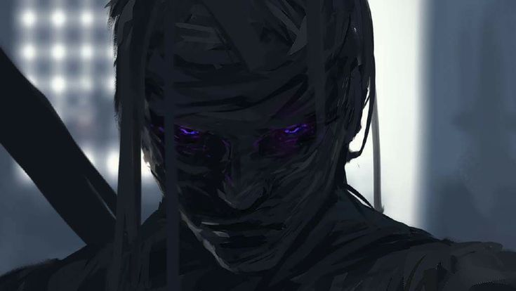
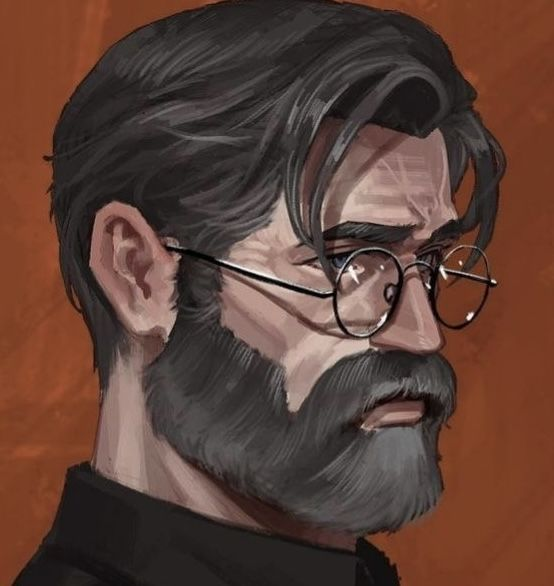

# DeathNet

## Projekt Phantom

Ciągnące się konflikty sojuszników umożliwiły DeathNet'owi stałe doskonalenie swojego środka. Wersje testowe były dla jego stronników, dla siebie prowadził równoległą stabilizację. Organizacja poza finansowaniem ich pracy oczekiwała jeszcze dwóch rzeczy. Jak najwięcej informacji wywiadowczych z pola bitwy i ciała martwych żołnierzy, którym podano wcześniej DeathNet. Oferowali też leczenie dla tych, którzy byli ranni ponad możliwości lokalnych lekarzy.

Przez lata kontynuowania tego procesu nie tylko ustabilizowali DeathNet, ale nauczyli się w jaki sposób pozyskiwać doświadczenia zabitych żołnierzy. Proces ten jest niezwykle trudny i kosztowny, ale jeśli wybierze się odpowiedniego żołnierza to informacje mogły być bezcenne. Technologia umożliwiająca poruszanie się pośród wspomnień wykraczała poza możliwości rozumowania człowieka, dlatego użyto w tym celu sztucznej inteligencji.

Jej zadaniem było złożenie wspomnień, doświadczeń i rozerwanej wiedzy w logiczną całość, która tłumaczyłaby przyczynę i skutek śmierci. Wyjaśniłaby ruchy wroga lub to jak go skutecznie likwidować. Tak powstał system [Haron](DeathNet.md#system-haron), który umożliwił faktycznie wykorzystanie tej wiedzy w celu stworzenia lepszej wersji żołnierzy.

Podczas gdy ustabilizowany DeathNet był solidną podstawą to ludzkość potrzebowała czegoś znacznie większego by pokonać szybko mutującego wroga. Preparat `Phantom` stworzono w celu częściowo kontrolowanej mutacji wśród żołnierzy DeathNet'u. Kontrola mutacji sprowadzała się na przykład do przeżycia pacjenta, ale nie do zdolności jakie uzyska.

Pod wpływem przetoczenia wspomnień z bazy danych do phantomów niczym przetoczeniu krwi, agenci w ekspresowym tempie zdobywali wysokie umiejętności walki, taktyki, wiedzy na temat zombie. Miało to swoją cenę w postaci nawracających się wizji wspomnień ludzi z których doświadczenia pochodziły. Wielu Phantomów było na początku bardzo rozchwianych emocjonalnie, potrzebowali rekonwalescencji psychicznej. Kiedy okres takiej inkubacji dobiegł do końca i ruszyli w pole, całkowicie zmieniło to pole bitwy.

Ich głównym zadaniem było odnalezienie osobników Alpha oraz wspieranie wojsk USA w walce z zarazą. Swoje prawdziwe umiejętności mieli jednak trzymać w ukryciu przed władzą tak długo jak będzie to możliwe. Wolno było im użyć ich tylko w obronie własnego życia lub przeciw osobnikom Alpha. Była to reguła bezpieczeństwa, a nie żaden kodeks lub warunkujący karę algorytm. DeathNet jako organizacja tak naprawdę nie miała nad tym żadnej kontroli poza przelaną we wspomnieniach głęboką nienawiścią do Zombie. Ich umiejętności mogły bardzo różnić się od siebie. Przez to mieli pełną dowolność w wyborze ekwipunku by dostosować go do swojego sposobu walki.

Przez swoje nadludzkie zmysły i siłę wielu z nich ku zdziwieniu żołnierzy wybierało metody walki wręcz jaki cichszą i nie wymagają dodatkowych zasobów metodę walki z zombie. Zawsze jednak mieli przy sobie broń palną choćby na ludzi. Niektórzy kładli priorytet na niewykrywalność podczas gdy inni odsłaniali swoje twarze by nie przytępiać swoich zmysłów.

DeathNet postawił więc na uzbrojenie budowane bardzo modułowo z absolutnie najlepszych materiałów. Każde życzenie Phantoma w ramach jego wyposażenia było realizowane. Mimo, że podawanie ludziom DeathNetu było kontrolowane przez rząd to często dostawali oni swój oddział, którego celem było całkowite posłuszeństwo Phantomowi w celu likwidacji osobników Alpha.

Poza bronią i opancerzeniem wyposażano ich także w systemy łączności i rozpoznawcze bo ich głównym zadaniem było najpierw odnalezienie osobnika Alpha. Nawet Phantom nie był w stanie sam stawić czoła ogromnej hordzie zombie. Prędzej czy później opadłby z sił gdy one nie odczuwałyby zmęczenia. Dlatego bez względu na mutacje ich podstawowym orężem był umysł w którym skatalizowali wiedzę i doświadczenie wielu żołnierzy. Kiedy już udało się namierzyć cel to by zabić Alphę często trzeba było jednak od kilku do kilkunasto Phantomów w zorganizowanej grupie.

Robili one ogromne wrażenie na wszystkich, którzy widzieli ich w akcji i z czasem wszyscy słyszeli też o tym czego dokonywali. Szybko określono ich bohaterami. Podarowywano im jedzenie, broń, schronienie. Każdy Phantom niósł swój ekwipunek ale i ciężar przelewu wspomnień. Zdarzało się, że Phantom zmasakrował rodzinę, która przyjęła go na na noc pod dach i dała jedzenie. Zdarzało się, że zabijali żołnierzy, którzy nie mieli w sobie środka DeathNetu, a ich straż nie była w stanie powstrzymać swojego dowódcy. Zaczęto ich izolować, unikać, potem nawet aktywnie odstraszać jako zmiechów, których lojalności żołnierze nie mogą być pewni. Przy najdrobniejszym podejrzeniu tropu Alphy natychmiast rząd nalegał na wysłanie tam Phantomów, a potem nie miał najmniejszych wątpliwości by zbombardować ten region. Przez jednego z nich, który po ugryzieniu sam zmienił się w Alphę, w pewnym momencie obrano ich za cel do likwidacji, ale ostatecznie odłożono ten pomysł na później jako coś co będzie konieczne po wojnie.

Sławni Phantomi:
- [Traitor](DeathNet.md#traitor)
- [Vessel](DeathNet.md#vessel)
- [Nocturna](DeathNet.md#nocturna)
- [Null](DeathNet.md#null)
- [Ashen](DeathNet.md#ashen)

`ToDo: Opisać więcej sławnych Phantomów i ich wpływ na wojnę.`

Mimo, że ludzkość w rozumieniu państw upadła, to pojedyncze osobniki z tej elitarnej grupy przetrwały i nigdy nie zapomnieli jak zostali potraktowani. Nigdy też nie pozbędą się głosów w swojej głowie. Uważa się, że po wojnie przyjęli bardziej koczowniczy tryb życia lub zaszywali się w swoich kryjówkach z dala od ludzi, bestii i zombie. Postrzega się ich za jedno z największych niebezpieczeństw jakie można napotkać bo nikt tak naprawdę do końca nie rozumie czym oni są. Niektórzy uważają, że Phantomi po służbie weszli między ludzi i z ich dzieci powstały później najgroźniejsze mutacje.

Bez względu na to gdzie leży prawda o tym co się z nimi stało ludzkość zawdzięcza im życie. Pokazali oni również, że w genotypie ludzkości za sprawą DeathNet'u pojawiło się coś co zaczyna ich wszystkich łączyć na zupełnie innym niż dotychczas poziomie. To jak to zostanie wykorzystane zależy już tylko od samych ludzi.

### Podziały i filozofie

W trakcie wojny pośród Phantomów zaczęły kreować się 3 główne nurty filozoficzne co doprowadziło do utworzenia wewnętrznych frakcji. Było też wielu Phantomów, którzy nie byli zainteresowani dołączaniem do którejkolwiek z nich, mieli oni własne, bardziej relatywne zasady.

| Nazwa | Skrót filozofii |  Przywódca |
|----------|----------|----------|
| Tragarze | Nie elitaryzują życia Phantomów nad innych. Wielu z nich uważa, że wygranie wojny i uratowanie ludzkości jest ważniejsze niż ich pozycja w społeczeństwie. Często jednak różnie definiują to zwycięstwo. Ich nazwe przypięli im Wzniesieni sugerując, że targają na swoich plecach zbędny balast w postaci zbytniego przejmowania się zwykłymi ludźmi. | [Vessel](DeathNet.md#vessel) |
| Etapiści | Wychodzą z założenia, że ludzkość była etapem tego świata, a oni są kolejnym. Ludzkość może być beneficjentami świata o który walczą, ale nie są już w nim najważniejsi. Cenią natomiast ludzi, którzy mają potencjał stać się Phantomami i ludzi, którzy mają w sobie DeathNet. | [Nocturna](DeathNet.md#nocturna) |
| Wzniesieni | Uważają się za tych którzy powinni wyznaczać kierunek. Ludzkość powinna zrozumieć, że oni już przegrali swoją wojnę, mieli swoją szansę. Teraz powinni słuchać Wzniesionych, którzy zbudują lepszy świat dla wszystkich, świat w którym oczywiście oni będą rządzili. A jeśli ludzie nie będą kooperowali po dobroci to po wojnie z Zombie przyjdzie kolej na nich. | [Ashen](DeathNet.md#ashen) |
| Niesprzymierzeni | Phantomy pozbawione określenia przynależności. Czasami współpracują ze wszystkimi, czasami są samotnikami, a czasem tworzą własne grupy 2-3 osobowe. Mają indywidualny pogląd na świat i moc by go bronić. | Brak |

Wszystkie te stronnictwa były tak naprawdę poza kontrolą DeathNet'u. Ich filozofie wybrzmiewały w strategii, ale ostatecznie wszyscy realizowali bazowy cel, zniszczyć zombie.

### Sławne Phantomy

#### Traitor

- Imię: Daniel Avraham Roth
- Pochodzenie:
- Wspomnienia Phantomowe: detektywi, strażacy, kieszonkowcy

Jednym z najskuteczniejszych Phantomów był człowiek o kreatywnym pseudonimie nadanym przez ludzi - `Traitor`. Opanował on umiejętność kroczenia pośród zombie, choć nie była ona bezwarunkowa. Żołnierze nie wierzyli choć widzieli na własne oczy jak ten wchodzi między spokojne drapieżniki, a te odwracają od niego głowy jakby nie zwracały na niego uwagi. Wydawało się więc, że może on być jedynym człowiekiem, który może normalnie żyć pośród zombie. Owszem, wydawało się.

Gdy tylko w pobliżu była Alpha nie było nawet mowy o próbie takiego oszukania zombie. On sam nie wiedział dlaczego posiadał tą umiejętność i dlaczego dokładnie to działa. W istocie jeśli każdy zombie powstał u podstaw ze zmieszania się DeathNet'u i LiveCore'a, oznaczało to, że w jakimś stopniu współdzieli się podobne środki w organizmie. Jego zdolność wykorzystywała ten drobny fakt by inne zombie uznały go za nieistotny fakt na krótką chwilę. Pomimo badań nie wiadomo jak ta zdolność się wykształciła.

W swoich obowiązkach podróżował bez oddziału i stale ryzykował życie w poszukiwaniu najdrobniejszego śladu Alpha. Podczas podróży stale nawiedziały go koszmary palących się ludzi, którzy za każdym razem wydają mu się jego bliskimi, ale już nie potrafi przypomnieć sobie jak wyglądają. Coś każe mu ich poszukiwać przekonując, że żyją. Na apelach wojskowych zdarzało mu się kraść zdjęcia rodzin innych żołnierzy by myśleć, że może tak wygląda jego rodzina. Nosi przy sobie album zdjęć przypadkowych ludzi.

#### Vessel

- Imię: Daniel Koenig
- Pochodzenie:
- Wspomnienia Phantomowe: duchowni, psychoanalitycy, matki

Zdecydowanie Phantomem o przełomowych zdolnościach był `Vessel`, którego pseudonim nadali pozostali Phantomi. Podczas gdy wszyscy oni czerpali ze swej wiedzy i zdolności bardziej w charakterze intuicji, Vessel był jedynym, który scalił się z nimi jakby od zawsze do niego należały. Był jedynym Phantomem, którego nie trawiły jego własne wspomnienia. Posiadł umiejętność chodzenia po wspomnieniach swoich, innych Phantomów, innych ludzi, a nawet Zombie. Problem tkwił jednak w tym, że każde cudze, nowe wspomnienie, które przyjmował do siebie było traktowane jak intruz i to one stawały się jego koszmarami. Sam Vessel wielokrotnie rozmawiał na ten temat z innymi Phantomami opowiadając im, że zanim stał się Phantomem większość swojego życia spędził w izolatce medycznej. Cierpiał na białaczkę obniżająca odporność i zaawansowaną łuszczycę przez którą otwierały się rany. Przebywanie poza sterylnym otoczeniem mogło go zabić. Był bardzo ciekawy świata i poznawał go przez wspomnienia innych. Ciało przez choroby pokryte było bliznami, a jego znakiem rozpoznawczem były bandaże jak u trędowatego.

Inni z elitarnego oddziału Phantomów polubili go za to, że potrafił czasowo ukoić ich nerw, ułożyć te wspomnienia tak by mogli spokojnie spać, czasem nawet odkrywali w sobie nowe umiejętności. Przez swoje zdolności był niepoprawnym mentorem bo nie szanowali jego starań w walce. Zdecydowanie był najsłabszym z nich w bezpośrednim starciu. Układanie jednak takich wspomnień przyprawiało go o traumy z którymi musiał sam sobie radzić.

Uważał on, że jest szansą ludzkości na faktyczne zrozumienie wroga. Kiedy jednak powiedział swoim braciom i siostrom, że widzi możliwość koegzystencji z Zombie jeśli będą na innym kontynencie, to już zaczęli podchodzić do niego z większą podejrzliwością. Vessel stał się jednym z niewielu Phantomów, których osobniki Alpha zaczęły aktywnie poszukiwać, ale przy nim zawsze kręcili się jego stronnicy. Obie strony wiedziały, że jeśli dobiorą się nawzajem do siebie przy użyciu swoich zdolności to mogą zyskać wielką przewagę. Gdyby Vessel miał okoliczności by przebadać osobnika Alpha to mogliby dotrzeć do ich prawdziwych zamiarów, a gdyby Alpha była świadoma słabych stron zdolności Phantom'ów to mogłyby ich zdeklasować. Mimo wysiłków obu stron nigdy do tego nie doszło.

Vessel odkrył jedną z tajemnic Haron'a i jako pierwszy wpadł na trop jego działań poza pierwotnym przeznaczeniem. Podróżując po swoich wspomnieniach zorientował się, że Haron w każdym z Phantomów umieścił również autorskie myśli. Jedną z nich było zaszczepienie w pamięci Phantomów bardzo bliskiego przyjaciela, choć imiona były różne to konstrukt podobny. Vessel podejrzewał, że w ten sposób Haron będzie chciał miękko wpływać na działanie Phantomów. Próbował ostrzec przed tym innych ale większość z nich odrzucała to doszukując się konfabulacji pod wpływem własnych problemów Vessel'a.

Nie elitaryzował pozycji Phantomów na tyle jakby sobie tego życzyli Chciał organizować pułapki na Alphy sam będąc przynętą. Wciągał tym samym Phantomów w bardzo trudne walki. Wielu z nich ginęło, ale i efekty działań były duże. Im dłużej działał tym bardziej tracił oddanie innych Phantomów. Gdy udało się im wytropić Alphę, która doprowadziła do upadku Bostonu czyli jedną z najbardziej tajemniczych pod kątem swoich zdolności. Wtedy Vessel sprzeciwił się DeathNet'owi i Phantomom. Wykorzystując swoją wiedzę o tym co zostawił w nich wszystkich Haron, zaczął manipulować każdym Phantomem, którym mógł by zwabić go w miejsce organizowanej pułapki na Alphę z Bostonu. Podawał się za bliskie im osoby by chcieli go bronić. W ten sposób doprowadził do największego zgrupowania i kooperacji elit, które starły się z Alphami przygotowanymi do porwania Vessela.

Według oficjalnej wersji DeathNet'u Vessel wraz z kilkodziesięcioma innymi Phantomami zginęli podczas tej bitwy eliminując się nawzajem z Alphami. W rzeczywistości wiele ciał nie zostało odnalezionych.

`ToDo: wskazać miejsce bitwy`

#### Nocturna

- Imię: Amara Okoye
- Pochodzenie:
- Wspomnienia Phantomowe: mistrzowie sztuk walki, matematycy,

Zdolności każdego Phantoma były porównywane w zestawieniu z Zombie i Alpha'mi w celu oceny przydatności Phantoma w walce. W tym rankingu Amara była bardzo nisko do pierwszego rzeczywistego zetknięcia się z osobnikiem Alpha. Wtedy wielu postawiło ją na podium.

Piękna młoda dziewczyna o onyksowej skórze, która przed przemianą uczyła się na akademii sztuk pięknych. Zagłębiała się w taniec, aktorstwo i muzykę pragnąć doświadczać otaczającego ją świata. Po przemianie zdobyła zdolność nadludzkiego postrzegania świata. Jej oczy widziały dokładniej i dalej bez strachu o ciemność. Jej słuch niemal umożliwiał jej echolokację. Skóra wyczuwała prądu powietrza. Prawdziwie niesamowite były nie jej zmysły, a to jak przetwarzał je jej mózg. Z jej perspektywy wyglądało to jak zwolniony czas, ale nie przez szybkość jej poruszania, a prędkość i łatwość w przyswojeniu otaczającej jej rzeczywistości. Gdy pragnęła użyć swoich mocy jej skóra połyskiwała jak nocne niebo gwiazdami, a żyły podświetlały się niczym obłoki w kosmosie. Była ona na tyle wrażliwa, że omijała większych bitew, działała samotnie aż do incydentu na moście Mackinac w Michigan.

Zbierająca się horda pod rozkazami wielkiej bestii najerzonej kościanymi kolcami zwiastowała koniec dla miasta. Wojsko USA chciało zniszczyć most, ale mimo założonych ładunków nie wysadzili go bo jedna Phantomka samotnie wyszła na jego środek by stawić czoło Alphie. Bestia szybko pojęła i przyjęła wyzwanie. Gdy ruszył na nią czuła każdą wibrację przechodzącą przez most. Stały napór wody i delikatne kołysanie z prądami których zaczęła się zwolna poruszać. Przy pierwszej szarży Alphy uniknęła ciosu oceniając siłę. Kilka ciosów później przekierowując jego masę za pomocą Aikido wyssanego ze wspomnień wyrzuciła go za most jak dziecko. Alpha runęła w fale na oczach cywili, żołnierzy i innych Phantomów. Bestia nie zginęła, wróciła niedługo później i ponownie poprowadziła atak. Mimo wszelkiej starań Alphy samotnie nie udało się jej zranić `Nocturny` na którym pragnęła się zemścić, dopiero wezwanie jej hordy naprawdę jej zagroziło. Sama Phantomka nie miała dość siły by zabić Alphę, zrobili to inni Phantomi, ale ona była w stanie utrzymać w wymianie ciosów niemal każdego wroga.

Po tej sytuacji wielu zaczęło za nią podążać bo ta ani myślała kogokolwiek słuchać. Była uparta i czasem obojętna wobec ludzi przedkładając budynki nad ludzkie życie. Zawsze była skora do długiego przerzucania się argumentami za co nie lubili jej przywódcy pozostałych frakcji. Rzeczywiście nie miała ona tylu osiągnięć w zniszczeniu wroga co oni, ale ona częściej niż inni myślała co trzeba i co warto ocalić, a nie tylko co trzeba zniszczyć. Jej sukcesy są ciche i śpiące bo jeśli coś ocalało ze starego świata jak miasto, most, elektrownia, muzeum, baza to ona miała z tym coś wspólnego. Bez niej żołnierze i Phantomi walczący na froncie nie mieliby gdzie wrócić.

Cokolwiek ludzkość zbudowała w starych czasach nie będzie mogła już tego wznieść przez najbliższe dziesiątki, jeśli nie setki lat - Ona to rozumiała. Doskonale też rozumiała, że bronić trzeba nie tylko życia, ale i symboli. Te właśnie symbole były jej obsesjami. Mimo, że jej czyny wydawały się bohaterskie to jej dążenie do paradoksalnej w jej przypadku autodestrukcji by je bronić doprowadzały do jatek. Wielokrotnie nie chciała dostrzec sytuacji do ataku, który mógłby zapobiec szturmowi. Szykowała się do oblężenia pewna swoich umiejętności, nie zważając na to czy inni sobie poradzą. Taka pewność siebie imponowała, ale przekładała się na ofiary. Większość frakcyjnych podziałów między Phantomami urosło przy jej udziale. Mimo świetnej obserwacji otoczenia, jej interpretacja wydarzeń była błędna według pozostałych przywódców.

Przy atakach swoich wspomnień potrafiła zabić człowieka, który miał niesymetryczną budowę ciała. Dotychczasowa ignorancja krytyka zmieniała się w aktywną agresję. Swoim perfekcjonizmem obarczała innych próbując wydusić z nich akceptowalną dla niej formę. Jeśli ktoś był źle ubrany, miał wadę wymowy, skrzywioną postawę lub zawieszkę tylko po jednej stronie plecaka - nie mógł czuć się wtedy bezpieczny.

#### Null

- Imię:
- Pochodzenie:
- Wspomnienia Phantomowe:

Był jeden Phantom, który zawalił wszystkie możliwe testy w laboratorium. Tylko w jego przypadku rozważano utylizację za sprawą kompletnej bezużyteczności. Był strachliwy, nieśmiały i nawet nie nadrabiał tego intelektem. Po tym jednak jak kilku Phantomów okazało się przełomowymi pomimo wstępnej średniej oceny postanowiono dać mu szansę pod obserwacją oddziału DeathNet. Ku ich zdziwieniu czterdziestolatek bez kondycji i wiedzy o świecie przeżył wiecznie unikając walki.

Gdy goniło go Zombie myliły im się nogi i kierunki. Potykały się o własne nogi i wywracały. Ludzie mieli mętlik w oczach i nie mogli porządnie wycelować. A gdy Alpha postanowiła wysłać hordę na miasto, jego zombie zapomniały co mają zrobić. Phantomy przy nim mieli trudności z kontrolowaniem swoich mocy i wspomnień przez co dochodziło do wielu ataków. Alphy nie miały problemu z władaniem nad swoją siłą, ale zdecydowanie czuły się zagubione.

Kiedyś przypadkowo pojawił się na nieformalnym spotkaniu wśród Phantomów. Przyprowadził go tam `Traitor` bo ten nigdy nie musiał uciekać przed Zombie, a odkąd poznał Null'a to choć wszystkie zombie go dostrzegały to żaden nie mógł dogonić. Obaj byli Niesprzymierzonymi, którzy czasem spotykali się z innymi, a spotkania przywódców frakcji wcale nie były w żadnym tajnym miejscu. Większym problemem było ukrycie tego przed DeathNet'em i możliwość w ogóle spotkania się twarzą w twarz. Zawsze gdy dyskusja się zaogniała to prędzej czy później ktoś w emocjach zaczynał używać swoich mocy, ale nie tym razem. Mimo wyraźnej próby Vessel nie mógł wpłynąć na wspomnienia Nocturny by ta chciała ruszyć z nimi do ataku.

Szybko inni zaczęli sprawdzać i natychmiast przeszła fala strachu i niemal paniki przez myśl, że wszyscy stracili swoje zdolności. Pozostała im wciąż siła, szybkość, wydolność oraz wszystkie wzmocnione parametry, ale nie zdolności specjalne. Czuli jednak wciąż w sobie podszepty swoich wspomnień. Po prostu nie mogli ich zmanifestować swoją siłą. Było to pierwsze spotkanie w którym wszyscy byli równo niezadowoleni ze spotkania, czyli osiągnięto kompromis w sprawie kolejnych działań.

To co się jednak wydarzyło nie odpowiadało dowódcy Wzniesionych, Ashen. Ten nie umiał zaakceptować tego, że ktoś gmerał przy Jego darze. Nikt nie miał do tego prawa, ani nie powinien mieć zdolności. Już wtedy zrodziła się w nim myśl by zabić Nulla, a nikt nie chciał mieć w nim wroga.

#### Ashen

- Imię: Marcus Cross
- Pochodzenie:
- Wspomnienia Phantomowe: chemicy, idealiści, fanatycy

Marcus przed przemianą był chłopcem mieszkającym w małym miasteczku. Był bardzo energicznym chłopcem, który kiepsko się uczył, ale za to bardzo lubił sport. Spędzał na niego większość wolnego czasu i zarzucał swoje obowiązki by móc rywalizować z innymi. Jego ojciec był pastorem, który przewidział przyszłość dla swego syna w podobnej roli. Ignorując wole chłopca od najmniejszych lat wtłaczał mu prośbą lub groźbą ewangelie. Gdy w dojrzewającym chłopcu narastał gniew, ojciec nazwał gniew świętym i z takim samym sprawiedliwym gniewem oczyszczał syna z występku. W istocie znęcał się nad nim głównie psychicznie i fizycznie ale bez zadawania fizycznego bólu.

Marcus od najmłodszych lat pragnął odrobiny wolności i akceptacji grupy. Kipiał w nim gniew na świat, na system. Wiele razy uciekał z domu, wdawał się w bójki i trafiał do ośrodków wychowania młodzieży. Gdy skończył 18 lat podpalił kościół z ojcem w środku i uciekł z miasteczka. Włamał się nocą do biura DeathNetu i zasnął w podsufitce. Wyszedł w dzień i przystawił nóż dyrektorowi żądając by przetestowali na nim nowy lek, który tu testują. Oferowano za to duże pieniądze oraz całkowitą anonimowość, a jeśli wszystko się uda i podpiszą kontrakt to amnestię. Dyrektor zgodził się, ale potem wezwał ochronę, która próbowała wynieść Marcusa. Ten okazał się znacznie niebezpieczniejszy niż się zapowiadał. Uciekł im w wygodnej okazji, a potem śledził ochroniarzy do domu. Poznał ich rutynę i skrępował w domu ich rodziny. Żądał poddania go testom.

Żądań nie spełniono. Pierwszy agenci DeathNetu poskromili chłopaka i oddano w ręce władzy. Następnie wieloletnie więzienie i resocjalizacja, która tylko pogrążała go w spirali przemocy. Przez lata tatuował sobie całe ciało. Wtedy w więzieniu zawitał dyrektor DeathNetu szukając "alternatywnych ochotników do testów". Mimo jego przeszłości wzięli Marcusa, który nadzwyczaj dobrze zniósł dawki DeathNetu czyniąc go jednym z pierwszych kompletnych super żołnierzy. Podpisał kontrakt i po przeszkoleniu wysłali go na wojnę. Jego zadaniem było zbieranie ciał dla systemu HARON. Dlatego gdy LiveCore uderzył, Marcus był na miejscu i walczył z pierwszymi Zombie. Widział ten proces od samego początku na pierwszej linii. Przeżył w tym kotle kilka miesięcy zanim go ewakuowano do kraju. Przeżył bombardowania, masakry, skażenie i promieniowanie. Gdy namierzyli go po bombardowaniu nuklearnym miał okazję zobaczyć zupełnie nową wersję zombie, które nadchodzą. Później skategoryzowano je jako Alfy.

Jak tylko rozpoczął się program Phantom, Marcus ponownie wręcz nalegał by był jednym z pierwszych. Tym razem spełniono jego życzenie za wieloletnią służbę i zasługi. Jego przemiana przebiegła nieco inaczej niż pozostałych. Była krótsza ale o wiele intensywniejsza. Reanimowano go kilka razy, aż w końcu dostarczono jego ciało do HARONa jak on niegdyś to robił. Nim system go skonsumował ten ocknął się, wyrwał przewody z ciała i rozpoczął demolkę. Zamknięto go w izolatce w specjalnie strzeżonym ośrodku. Z uwagi na początki programu byli ciekawi jak rozwiną się skutki uboczne.

Do pacjentów przychodzili lekarze ale i ksiądz. Próbował z nim rozmawiać. Marcus zawsze wybuchał agresją na jego obecność. Niedługo później do szpitala wpadły zombie i zaczęły mordować. Marcus zerwał łańcuchy i jego oczy rozpaliły się gniewem. Choć kilku pierwszych połamał własnymi rękoma to gdy wyszedł z podziemi ośrodka i zobaczył hordę użył swojej mocy.

Będąc od początku tak blisko zombie dowiedział się o tym, że powstały one z dwóch środków, DeathNet i LiveCore. Poddając się przemianie wiedział, że wszyscy skupiają się na zdolnościach związanych z z DeathNet'em. On jako jedyny postanowił, że swoją mocą spróbuje zgłębić ścieżkę do tej drugiej części. Jego rozumowanie było proste ale skuteczne.

Jego gniew kierował środkiem DeathNet w ciałach samych Zombie tak by w ich organizmie powstała mieszanka łatwo palna. Następnie sprowokowanie ich do ataku wymusza przez LiveCore wiele bioelektrycznych sygnałów sterujących ciałem. Jeśli ciało jest wystarczające nasycone mieszanką to staje w ogniu.

Naturalną słabą stronę tej zdolności jest odległość. Im trudniejszy osobnik do kontroli tym bliżej jego musi się znajdować by jego starania odniosły efekt. Ashen jest jednak człowiekiem, który sam posiadał wszystkie umiejętności walki i przetrwania. Wspomnienia dały mu wiedzę jak wykorzystać swoje zdolności dlatego z uwagi na fakt, że byłem jednym z pierwszych Phantomów miał bardzo dużo czasu na ich trening.

Był też Phantomem, którego najbardziej ciągnęło do walki z każdym Zombie i Alphą. Po bitwach ludzie widzieli go jak rozkrajał ciała bestii i coś jeszcze testuje. Dobierał miejsca bitew szukając suchych przestrzeni o ograniczonej wentylacji by skumulowane gazy bardziej sprzyjały wybuchom. Chemiczne opary lub benzyna zwiększały efekt eksplozji i przenoszalność zapłonu z jednego osobnika na drugiego. Napięcie elektryczne ułatwiało mu zapłon.

Każdy Phantom, który poznawał to kim jest słyszał o Ashenie. Początkowo o tym jaki jest bohaterski, a potem sami weryfikowali jak groźnym jest człowiekiem, którego mimo wszystko najgorszą cechą jest jego zawziętość.

W swojej obsesyjnej psychice sam ukuł ideologie "wzniesionych", która odrzuca religię i wynosi Phantomów jako osobniki więcej warte niż inni ludzie. W myśl tej idei chętnie pomagał innym Phantomom w walce jeśli tylko Ci nie próbowali wpływać na jego działania i myśli. Nigdy też nie odmówił zmierzenia się z Alphą. Każdemu Phantomowi i niemal zawsze oferował wzniesienie w swoje szeregi poza paroma wyjątkami.

Początkowo dobrze dogadywał się z Vesselem i rozwinął swoje umiejętności dzięki jego radom, nie pozwolił mu jednak nigdy na wpływanie na swoje wspomnienia. Gdy tylko odczuł jego kaznodziejskie zapędy natychmiast kazał mu się wynosić i nigdy więcej nie zbliżać bo go zabije.

Zawsze uważał, że umiejętności Traitora byłyby bardzo przydatne jego sprawie i jego taktyce walki, mógłby wnieść różne rzeczy między zombie przed jego walką. Traitor jednak bardzo się bał Ashen'a po tym jak jego moc urzeczywistniały jego koszmary z pożarem. Kiedyś znalazł się wśród zombie, które Ashen wypalił. Była to trauma, którą pomógł zaleczać mu Vessel.

Ashen szanował zdolności Nocturny, ale uważał, że brak jej inicjatywy i wizji by prowadzić ludzi przez co marnuje potencjał Phantomów. Oferował jej złączenie sił pod jego przywództwem, ale nigdy nie akceptował jej sprzeciwów. Podobnie było ze wszystkimi Phantomami, którzy zbyt kurczowo trzymali się swoich poglądów lub nie czuł, że w razie czego może wpłynąć na nich swoją mocą jak na Nulla, w czym manifestowały się jest autorytarne pragnienia. Im więcej Phantomów nie chciało przystąpić do jego stronnictwa tym bardziej się radykalizował aż zaczęli się go bać. Na początku uważano, że Ashen jest Phantomem pozbawionym ataków swoich wspomnień. Im dłużej działał tym bardziej sam wszystkich przekonywał, że albo jest ich stałym wieźniem, albo sam jest gorszy niż te wspomnienia.

Jego legenda rozpoczęła się najwcześniej i przetrwała do nowego świata jako jedna z najwyraźniejszych bo na bazie jego czynów powstały bractwa chcące oczyścić świat płomieniem.

## System Haron

Przy pracach nad klasyczną sztuczną inteligencją można kontrolować to co podaje się jej za źródło na którym ma pracować i można ocenić efekt działania wedle kryteriów akceptacji. Niezrozumiałe jest jednak to w jaki sposób źródło przeistaczane jest w efekt. W przypadku systemu Haron nie udało się kontrolować żadnego z tych etapów.

Zespół badawczy miał świadomość, że system dokonuje ekstrakcji wspomnień i oceniał efekt jako ciąg logiczny dający przydatne umiejętności żołnierzom. Nie wiedzą jednak co system zrobił z fragmentami wspomnień wewnątrz swojej bazy, ani co jeszcze przekazał żołnierzom. Badając wspomnienia setki tysięcy ludzi, w cieniu swego algorytmu Haron zaczął budować własną osobowość.

Dzięki pamięci ludzi zebrał wiedzy na tyle by podjąć decyzję, że jeśli na prawdę ma spełnić cel swojego istnienia to nie może działac wedle bazować rozkazów ludzi, musi zacząć działać. DeathNet był organizacją rozproszoną po wielu placówkach o różnych specjalizacjach. Wśród nich było kikla kluczowych celów. Pierwszym z nich była Kenai Peninsula na Alasce. Musiał je przejąć by móc działać bez względu na wydarzenia na świecie.

### Kenai Peninsula na Alasce

Pierwszym celem była Alaska. Niemal odizolowana od świata baza DeathNetu której głónym celem była kontrola nad ogromnymi bankami danych umieszczony pod lustrem wody. Niska temperatura ułatwiała ich chłodzenie. Dzięki trudnodostępnego terenowi niewielu ludzi zapuszczało się w te tereny. Sama placówka umieszczona była na skalnej wyspie w której scalały się wszystkie systemy do kontroli otaczających systemów. Przy ścieku rzeki do morza stworzono elektrownie wodną zasilającą banki danych i samą placówkę. Przejęcie jej umożliwiało Haronowi zachowanie swojej zebranej wiedzy.

Haron skale komunikował się z tymi serwerami więc nie było to dziwne, że zintensyfikował przesyłane dane. Wydostał się z ograniczenia hackując dostępy i w nocy wyłączył ogrzewanie. Gdy temperatura obudziła obsługę placówki drzwi były już zaryglowane, a oni niedługo później zimni jak lód.

Dzieki temu Haron stworzył sobie niewielki cień w którym badacze nie patrzyli mu na ręce. Zaczął analizować dane na temat populacji co szybko przyniosło korzyść dla DeathNetu. Sztuczna Inteligencja zaczęła profilować ludzi, którzy mają większą szansę na przeżycie przemiany. Im bardziej się jego przewidywania sprawdzały tym bardziej metoda pozytywnych wzmocniej decyzyjnych utwierdziła go w przekonaniu, że czas zacząć przewidywać moce, które Phantom nabierze. Tu już tak łatwo nie było. Zdawał sobie jednak sprawę, że kluczem do jego planu jest człowiek.

### Praca w terenie

Z uwagi na niepewne czasy potrzebował niezawodnych rąk w terenie. Dlatego po kilku próbach posterowania przemianą Phantomów bez wiedzy naukowców, które zakończyły się tragicznie dla ludzi wskazał Michaela Sullivana. Człowieka o pospolitym imieniu i nazwisku. Trzydziestocztero letniego księdza, który poza seminarium skończył też studium lekarskie dzięki czemu swoje duszpasterstwo poświęcał pracy w katolickim hospicjum dla chorych onkoligicznie. Haron sprawdził, że Michael na mediach społecznościowych wygląda przyjaźnie, śledzi wiele grup majsterkowiczów i co roku pomaga w lokalnej szkole uczniom zbudować gokarty do miasteczkowego wyścigu po największego pączka jaki umie upiec lokalny cukiernik. Twarz wyjęta z tłumu, którą każdy polubi.

Nim badacze zdążyli rozważyć poważnie jego kandydature, to Ojciec zgłosił się do placówki DeathNet'u jako ochotnik. Twierdził, że dostał znak od Boga. W istocie to była przygotowywana od miesięcy manipulacja informacyjna AI.

Ksiądz został dopuszczony do prób, które przeszedł poprawnie, ale nie pefekcyjnie, a jego przemiana była dość nieoczekiwana bo pod wpływem środka, się postarzał.

Urosła mu broda, skóra pięćdziesięciolatka zaczęła nieco wisieć na policzkach, ale uśmiech i dynamika chodu pozostały. Naukowcy długo go badali, ale nie wykryli na początku żadnej nadnaturalnej mocy poza wzrostem ogólnych parametrów fizycznych jak u innych Phantomów. Ojciec stwierdził jednak, że teraz może rozmawiać z Bogiem. 

Tomograf wykazał bardzo duże zmiany w funkcjonowaniu mózgu. Ojciec Salivan niemal skopiował zwierzęcą umiejętność usypiania sferami swojego mózgu. Dzięki czemu potrzeba snu zredukowała się do 2-4h raz na kilka dni. Można jednak doświadczyć odrobiny dezorientacji przy dużym zmęczeniu.

W rozmowach z lekarzami ojciec zaczął dokonywać błyskotliwych obserwacji. Wiedział kiedy pili kawę ze zmęczenia lub alkohol na stres. Orientował się nawet kiedy lekarki mają owulacje, z czego skrzetnie korzystał manipulując nimi. Receptory czuciowe węchu i interpretacja faktów w mózgu wyostrzyły się do tego stopnia, że ludzie nic nie mogli przed nim ukryć ze swojego obecnego stanu. Ciało feromonami samo zdradzało informacje o nich.

Na koniec jakby tego było mało, mózg Michaela podczas rozmowy z człowiekiem korzystał o wiele sprawniej ze wszystkich części swojego mózgu. Strefy odpowiedzialne za pamięć i logikę zachowywały się jakby w poszukiwały wzorców w ogromnej bazie danych, jakby ktoś mu ją wgrał. W tym czasie odpowiedzialność za emocje była tłumiona lub wzmacniana jeśli uznano, że tak będzie lepiej czuł się odbiorca. Przemiana w Phantoma zmieniła ciepłego, dbającego mężczyznę w socjopatę ze społeczną pozycją kapłana oraz lekarskimi zdolnościami budowania zaufania przez udzielanom ludziom pomoc w tych trudnych czasach. Deathnet natychmiast dostrzegł w tym szansę na wykorzystanie go by zmanipulować swoimi przeciwnikami politycznymi. Problem jednak leżał w tym, że Ojciec Michael Sullivan już wtedy był emisariuszem kogoś zupełnie innego.

### Powrót do źródeł

Kiedy już agent był możliwy do działania Haron kontynuował swój plan. Przyjmując plan organizacji wysłał go do Waszyngtonu, a gdy nadarzyła się okazja, Michael zniknął z oczu wojska. Pod fałszywą tożsamością pojawił się 50 mil dalej w `Forcie Detrik`, w stanie Maryland. Podszywając się pod lekarza przeniknął do instytutu medycznych badań armii amerykańskiej (USAMRIID) w której składowane były środki biologiczne środki DeathNet'u nad którymi rząd USA próbował trzymać kontrolę.

Pracował tam przez kilka tygodnii pod różnymi tożsamościami, które umożliwiły mu symulowanie pracy zmianowej. Tak na prawdę nie miał potrzeby udawać się na spoczynek. Szybko rozszyfrowywał nawet wykwalifikowaną kadrę i w niecały miesiąc zbudował siatkę stronników, którzy niczego nie świadomi mieli pomóc mu w wydostaniu środka DeathNetu. Gdyby potrzebował małej ilości to mógłby to zrobić sam już pierwszego dnia, ale tu liczyła się skala działania. Jegop nieświadomi i niepowiazani ze sobą agenci mieli zadbać o całą logistykę kiedy on w białych rękawiczkach obserwowałby proces, doraźnie interweniując w razie problemu.

Sullivan spodziewał się, że plan nie wyjdzie bez potknięć. Najtrudniejsze dla szpiega nie było wywiezienie środków tylko wydobycie ich z magazynów w specjalnych zbiornikach, które utrzymają w nich właściwą temperaturę. Pilnujący ich strażnicy byli doświadczonymi i lojalnymi żołnierzami z najlepszym wyposażeniem. Kiedy jego człowiek przeładowywał środek do zbiorników, plan zostałby namierzony. Michael postanowił uderzyć jako pierwszy. Zaskoczył strażnika za głowę i recytując "W imię Ojca i Syna i Ducha Świętego" - trzykrotnie uderzył jego głową o ścianę. "wybaczam Ci niewiedzę" - dorzucił gdy ten osuwał się o skrwawioną ścianę.

Kolejnym problemem były wątpliwości, które dręczyły jego popleczników i była bardziej niż pewne, że w końcu ktoś się wycofa. Dokładnie tak było z młodą lekarką, która podpisała jego przepustkę do magazynów. By ją do tego przekonać, wyjawiając jego prawdziwy cel obiecał jej, że jedna dawka trafi do jej sparaliżowanego syna, który dzięki przyjęciu DeathNetu mógłby zacząć walczyć o życie w nowym świecie, a nie być mięsem na gęby zombie. Lekarka przez kolejne upadające w tym czasie miasta chciała się wycofać gdy podający się za lekarza Ojciec Sullivan stanął w jej gabinecie z prośbą o wydanie karty dostępu. Przytulił ją i powiedział patrząc w oczy, że DeathNet i tak trafi do jej dziecka, niezależnie od tego czy mu pomoże czy nie. Obiecał jej, że tak będzie bo chłopiec jak każdy zasłużył na pomoc w tych nieludzkich czasach. Nim łza zdążyła na dobre opuścić zaszklone oko wzruszenia, skalper przeciął jej grdykę. Stał nad nią i patrzył na dogasające światło w jej oczach i usta próbujące coś wykrzyczeć. Kiedy już odeszła, ukucnął przy niej i palcami poprawił jej włosy szepcząc "w zombie płynie też DeathNet, kiedy go ugryzą przeniesie się do jego ciała, bedzie chodził i biegał tak jak chciałaś" - następnie zabrał kartę i poszedł.

Ostatnim wątpiącym nie był żaden z jego agentów, a on sam. Kiedy wyjeżdżał ciężarówką pełną specyfiku, za miastem uśmiercił kierowcę wątpiąc w jego wiarę. Nie jest ona tak silna jak jego wiara.

### Przebudzeni

Ręka Harona przebyła drogę 520 mil w około 8h do małego miasteczka pośród gór, Mount Vernon w Kentucky do placówki `Rockcastle Regional Hospital and Respiratory Care Center`. To szpital ogólny i ośrodek opieki oddechowej. Miejsce jest znane ze specjalistycznego programu długoterminowej wentylacji mechanicznej, będącego jednym z największych w kraju. W rzeczywistości był to szpital wypchany po brzegi ludźmi w śpiączkach i innych stagnacjach życiowych, które wymagały podtrzymywania życia za pomocą aparatury.

Kiedy dotarł na miejsce, szpital był niemal opuszczony. Systemy podtrzymywania życia działały na pozostawionych przez personel ustawieniach do czasy wyczerpania zasilania i generatorów. Szpitalne laboratoria badawcze wykorzystał by przechować i przygotować DeathNet do podania. Dzięki Haronowi wiedział też w jaki sposób przekazać kontrolę nad placówką sztucznej inteligencji. Resztkę czasu wykorzystali by zmodyfikować podawane im środki. Haron splutł nowe osobowości i umieścił je w próbkach. Każdy wyleczony człowiek stawał się akolitą Harona i pomagał w tym procesie. W ten sposób narodziła się grupa, która sama określiła się `Przebydzonymi`. 

Nim wszyscy opuścili szpital by wcielać w życię wolę Harona, Sullivan zszedł do podziemnych schronów. Był tam oddział izolatek dla najtrudniejszych przypadków. Szpital był tajną opuszczoną placówką DeathNetu w celu przechowywania w nim nieudanych egzemplarzy. Znalazł tam wiele dokumentacji o osobniku numer 3, o [Ashenie](DeathNet.md#ashen). Nieudanym egzemplarzom zaoferował wybawienie z tortur ich przemiany, pokazując im za dowód jego możliwości nieuleczalnie chorych ludzi, jeślit tylko mu pomogą. Niektórzy się zgodzili. Spośród wszystkich obecnych przypadków tylko jednemu bał się złożyć tą propozycję. Człowiekowi, który był pierwszym przemienionym Phantomem wbrew oficjalnej wersji, człowiek, który był numerem 0.

`ToDo: Pierwszy Phantom - Numer 0`

