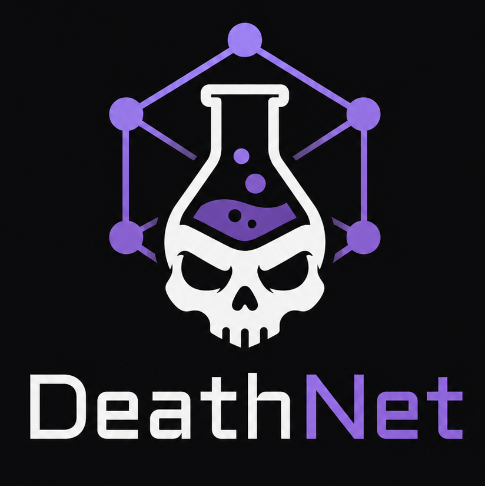
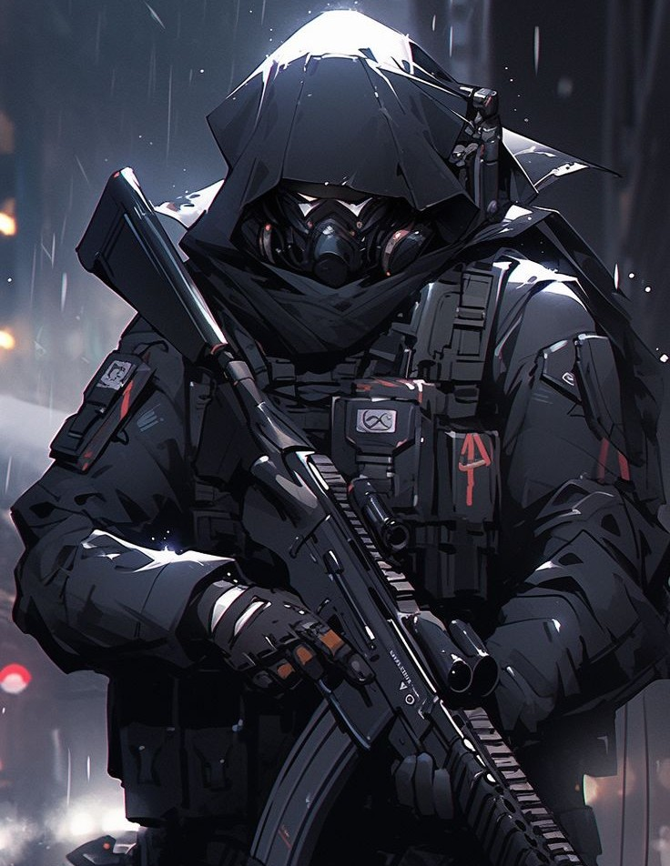

# DeathNet

## Projekt Phantom

Ciągnące się konflikty sojuszników umożliwiły DeathNet'owi stałe doskonalenie swojego środka. Wersje testowe były dla jego stronników, dla siebie prowadził równoległą stabilizację. Organizacja poza finansowaniem ich pracy oczekiwała jeszcze dwóch rzeczy. Jak najwięcej informacji wywiadowczych z pola bitwy i ciała martwych żołnierzy, którym podano wcześniej DeathNet. Oferowali też leczenie dla tych, którzy byli ranni ponad możliwości lokalnych lekarzy.

Przez lata kontynuowania tego procesu nie tylko ustabilizowali DeathNet, ale nauczyli się w jaki sposób pozyskiwać doświadczenia zabitych żołnierzy. Proces ten jest niezwykle trudny i kosztowny, ale jeśli wybierze się odpowiedniego żołnierzera to informacje mogły być bezcenne. Technologia umożliwiająca poruszanie się pośród wspomnień wykraczała poza możliwości rozumowania człowieka, dlatego użyto w tym celu sztucznej inteligencji.

Jej zadaniem było złożenie wspomnień, doświadczeń i rozerwanej wiedzy w logiczną całość, która tłumaczyłaby przyczynę i skutek śmierci. Wyjaśniłaby ruchy wroga lub to jak go skutecznie likwidować. Tak powstał system [Haron](DeathNet.md#system-haron), który umożliwił faktycznie wykorzystanie tej wiedzy w celu stworzenia lepszej wersji żołnierzy.

Podczas gdy ustabilizowany DeathNet był solidną podstawą to ludzkość potrzebowała czegoś znacznie większego by pokonać szybko mutującego wroga. Preparat `Phantom` stworzono w celu częściowo kontrolowanej mutacji wśród żołnierzy DeathNet'u. Kontrola mutacji sprowadzała się na przykład do przeżycia pacjenta, ale nie do zdolności jakie uzyska.

Pod wpływem przetoczenia wspomnień z bazy danych do phantomów niczym przetoczeniu krwii, agenci w ekspresowym tempie zdobywali wysokie umiejętności walki, taktyki, wiedzy na temat zombie. Miało to swoją cenę w postaci nawracających się wizji wspomnień ludzi z których doświadczenia pochodziły. Wielu Phantomów było na początku bardzo rozchwianych emocjonalnie, potrzebowali rekonwalescencji psychicznej. Kiedy okres takiej inkubacji dobiegł do końca i ruszyli w pole, całkowicie zmieniło to pole bitwy.

Ich głównym zadaniem było odnalezienie osobników Alpha oraz wspieranie wojsk USA w walce z zarazą. Swoje prawdziwe umiejętności mieli jednak trzymać w ukryciu przed władzą tak długo jak będzie to możliwe. Wolno było im użyć ich tylko w obronie własnego życia lub przeciw osobnikom Alpha. Była to reguła bezpieczeństwa, a nie żaden kodeks lub warunkujący karę algorytm. DeathNet jako organizacja tak na prawdę nie miała nad tym żadnej kontroli poza przelaną we wspomnieniach głęboką nienawiścią do Zombie. Ich umiejętności mogły bardzo różnić się od siebie. Przez to mieli pełną dowolność w wyborze ekwipunku by dostosować go do swojego sposobu walki.

Przez swoje nadludzkie zmysły i siłę wielu z nich ku zdziwieniu żołnierzy wybierało metody walki wręcz jaki cichszą i nie wymagają dodatkowych zasobów metodę walki z zombie. Zawsze jednak mieli przy sobie broń palną choćby na ludzi. Niektórzy kładli priorytet na niewykrywalność podczas gdy inni odsłaniali swoje twarze by nie przytępiać swoich zmysłów.

DeathNet postawił więc na uzbrojenie budowane bardzo modułowo z absolutnie najlepszych materiałów. Każde życzenie Phantoma w ramach jego wyposażenia było realizowane. Mimo, że podawanie ludziom DeathNetu było kontrolowane przez rząd to często dostawali oni swój oddział, którego celem było całkowite posłuszeństwo Phantomowi w celu likwidacji osobników Alpha.

Poza bronią i opancerzeniem wyposażano ich także w systemy łączności i rozponawcze bo ich głównym zadaniem było najpierw odnalezienie osobnika Alpha. Nawet Phantom nie był w stanie sam stawić czoła ogromnej hordzie zombie. Prędzej czy później opadłby z sił gdy one nie odczuwałyby zmęczenia. Dlatego bez względu na mutacje ich podstawowym orężem był umysł w którym skatalizowali wiedzę i doświadczenie wielu żołnierzy. Kiedy już udało się namierzyć cel to by zabić Alphe często trzeba było jednak od kilku do kilkunasto Phantomów w zorganizowanej grupie. 

Robili one ogromne wrażenie na wszystkich, którzy widzieli ich w akcji i z czasem wszyscy słyszeli też o tym czego dokonywali. Szybko określono ich bohaterami. Podarowywano im jedzenie, broń, schronienie. Każdy Phantom niósł swój ekwipunek ale i ciężar przelewu wspomnień. Zdarzało się, że Phantom zmasakrował rodzinę, która przyjęła go na na noc pod dach i dała jedzenie. Zdarzało się, że zabijali żołnierzy, którzy nie mieli w sobie środka DeathNetu, a ich straż nie była w stanie powstrzymać swojego dowódcy. Zaczęto ich izolować, unikać, potem nawet aktywnie odstraszać jako zmiechów, których lojalności żołnierze nie mogą być pewni. Przy najdrobniejszym podejrzeniu tropu Alphy natychmiast rząd nalegał na wysłanie tam Phantomów, a potem nie miał najmniejszych wątpliwości by zbombardować ten region. Przez jednego z nich, który po ugryzieniu sam zmienił się w Alphę, w pewnym momencie obrano ich za cel do likwidacji, ale ostatecznie odłożono ten pomysł na później jako coś co będzie konieczne po wojnie. 

Sławni Phantomi:
- [Traitor](DeathNet.md#traitor)

`ToDo: Opisać więcej sławnych Phantomów i ich wpływ na wojnę.`

Mimo, że ludzkość w rozumieniu państw upadła, to pojedyncze osobniki z tej elitarnej grupy przetrwały i nigdy nie zapomnieli jak zostali potraktowani. Nigdy też nie pozbędą się głosów w swojej głowie. Uważa się, że po wojnie przyjęli bardziej koczowniczy tryb życia lub zaszywali się w swoich kryjówkach z dala od ludzi, bestii i zombie. Postrzega się ich za jedno z największych niebezpieczeństw jakie można napotkać bo nikt tak na prawdę do końca nie rozumie czym oni są. Niektórzy uważają, że Phantomi po służbie weszli między ludzi i z ich dzieci powstały później najgroźniejsze mutacje.

Bez względu na to gdzie leży prawda o tym co się z nimi stało ludzkość zawdzięcza im życie. Pokazali oni również, że w genotypie ludzkości za sprawą DeathNet'u pojawiło się coś co zaczyna ich wszystkich łączyć na zupełnie innym niż dotychczas poziomie. To jak to zostanie wykorzystane zależy już tylko od samych ludzi.

### Sławni Phantomi

#### Traitor

- Imię: Daniel Avraham Roth
- Pochodzenie:
- Wspomnienia Phantomowe: detektywi, strażacy, kieszonkowcy

Jednym z najskuteczniejszych Phantomów był człowiek o kreatywnym pseudonimie nadanym przez ludzi - `Traitor`. Opanował on umiejętność kroczenia pośród zombie, choć nie była ona bezwarunkowa. Żołnierze nie wierzyli choć widzieli na własne oczy jak ten wchodzi między spokojne drapieżniki, a te odwracają od niego głowy jakby nie zwracały na niego uwagi. Wydawało się więc, że może on być jedynym człowiekiem, który może normalnie żyć pośród zombie. Owszem, wydawało się. 

Gdy tylko w pobliżu była Alpha nie było nawet mowy o próbie takiego oszukania zombie. On sam nie wiedział dlaczego posiadał tą umiejętność i dlaczego dokładnie to działa. W istocie jeśli każdy zombie powstał u podstaw ze zmieszania się DeathNet'u i LiveCore'a, oznaczało to, że w jakimś stopniu współdzieli się podobne środki w organizmie. Jego zdolność wykorzystywała ten drobny fakt by inne zombie uznały go za niestotny fakt na krótką chwilę. Pomimo badań nie wiadomo jak ta zdolność się wykształciła. 

W swoich obowiązkach podróżował bez oddziału i stale ryzykował życie w poszukiwaniu najdrobniejszego śladu Alpha. Podczas podróży stale nawiedziały go koszmary palących się ludzi, którzy za każdym razem wydają mu się jego bliskimi, ale już nie potrafi przypomnieć sobie jak wyglądają. Coś każe mu ich poszukwiać przekonując, że żyją. Na apelach wojskowych zdarzało mu sie kraść zdjęcia rodzin innych żołnierzy by myśleć, że może tak wygląda jego rodzina. Nosi przy sobie album zdjęć przypadkowych ludzi.

## System Haron

Przy pracach nad klasyczną sztuczną inteligencją można kontrolować to co podaje się jej za źródło na którym ma pracować i można ocenić efekt działania wedle kryteriów akceptacji. Niezrozumiałe jest jednak to w jaki sposób źródło przeistaczane jest w efekt. W przypadku systemu Haron nie udało się kontrolować żadnego z tych etapów.

Zespół badawczy miał świadomość, że system dokonuje ekstrakcji espomnień i oceniał efekt jako ciąg logiczny dający przydatne umiejętności żołnierzom. Nie wiedza jednak tak na prawdę co system zrobił z fragmentami wspomnień wewnątrz swojej bazy, ani co jeszcze przekazał żołnierzom. Badając wspomnienia setki tysięcy ludzi, w cieniu swego algorytmu Haron zaczął budować własną osobowość.

`ToDo: Opiasć AI Haron'a`