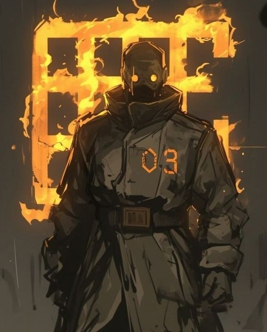
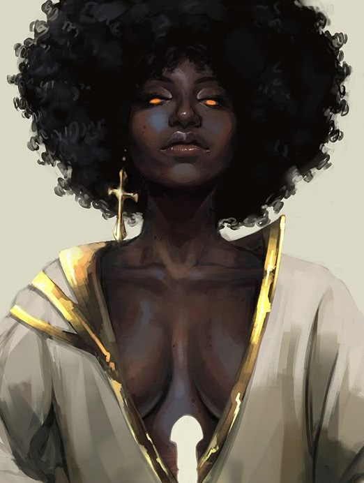

#### Null

- Imię:
- Pochodzenie: 
- Wspomnienia Phantomowe: 

Był jeden Phantom, który zawalił wszystkie możliwe testy w laboratorium. Tylko w jego przypadku rozważano utylizację za sprawą kompletnej bezużyteczności. Był strachliwy, nieśmiały i nawet nie nadrabiał tego intelektem. Po tym jednak jak kilku Phantomów okazało sie przełomowymi pomimo wstepnej średniej oceny postanowiono dać mu szansę pod obserwacją oddziału DeathNet. Ku ich zdziwieniu czterdziestolatek bez kondycji i wiedzy o świecie przeżył wiecznie unikając walki. 

Gdy goniło go Zombie myliły im się nogi i kierunki. Potykały się o własne nogi i wywracały. Ludzie mieli mętlik w oczach i nie mogli porządnie wycelować. A gdy Alpha postanowiła wysłać hordę na miasto, jego zombie zapomniały co mają zrobić. Phantomy przy nim mieli trudności z kontrolowaniem swoich mocy i wspomnien przez co dochodziło do wielu ataków. Alphy nie miały problemu z władaniem nad swoja siłą, ale zdecydowanie czuły się zagubione.

Kiedyś przypadkowo pojawił się na nieformalnym spotkaniu wśród Phantomów. Przyprowadził go tam `Traitor` bo ten nigdy nie musiał uciekać przed Zombie, a odkąd poznał Null'a to choć wszystkie zombie go dostrzegały to żaden nie mógł dognić. Obaj byli Niesprzymierzonymi, którzy czasem spotykali się z innymi, a spotkania przywódców frakcji w cale nie były w żadnym tajnym miejscu. Większym problemem było ukrycie tego przed DeathNet'em i możliwość w ogóle spotkania się twarzą w twarz. Zawsze gdy dyskusja się zaogniała to prędzej czy później ktoś w emocjach zaczynał uzywać swoich mocy, ale nie tym razem. Mimo wyraźnej próby Vessel nie mógł wpłynąć na wspomnienia Nocturny by ta chciała ruszyć z nimi do ataku.

Szybko inni zaczęli sprawdzać i natychmiast przeszła fala strachu i niemal paniki przez myśl, że wszyscy stracili swoje zdolności. Pozostała im wciąż siła, szybkość, wydolność oraz wszystkei wzmocnione parametry, ale nie zdolności specjalne. Czuli jednak wciaż w sobie podszepty swoich wspomnień. Po prostu nie mogli ich zmanifestować swoją siłą. Było to pierwsze spotkanie w którym wszyscy byli równo niezadowoleni ze spotkania, czyli osiągnięto kompromis w sprawie kolejnych działań.

To co sie jednak wydarzyło nie odpowiadało dowódcy Wzniesionych, Ashen. Ten nie umiał zaakceptować tego, że ktoś gmerał przy Jego darze. Nikt nie miał do tego prawa, anie nie powinien mieć zdolności. Już wtedy zrodziła się w nim myśl by zabić Nulla, a nikt nie chciał mieć w nim wroga.

#### Ashen

- Imię: Marcus Cross
- Pochodzenie: 
- Wspomnienia Phantomowe: chemicy, idealiści, fanatycy

Marcus przed przemianą był chłopcem mieszkającym w małym miasteczku. Był bardzo energicznym chłopcem, który kiepsko się uczył, ale za to bardzo lubił sport. Spędzał na niego większość wolnego czasu i zarzucał swoje obowiązki by móc rywalizować z innymi. Jego ojcec był pastorem, który przewidział przyszłość dla swego syna w podobnej roli. Ignorując wole chłopca od najmniejszych lat wtłaczał mu prośbą lub groźbą ewangelie. Gdy w dojrzewającym chłopcu narastał gniew, ojciec nazwał gniew świętym i z takim samym sprawiedliwym gniewem oczyszczał syna z występku. W istocie znęcał się nad nim głównie psychigcznie i fizycznie ale bez zadawania fizycznego bólu.

Marcus od najmłodszych lat pragnął odrobiny wolności i akceptacji grupy. Kipiał w nim gniew na świat, na system. Wiele razy uciekał z domu, wdawał się w bójki i trafiał do ośrodków wychowania młodzieży. Gdy skończył 18 lat podpalił kościół z ojcem w środku i uciekł z miasteczka. Włamał się nocą do biura DeathNetu i zasnął w podsufitce. Wyszedł w dzień i przystawił nóż dyrektorowi żądając by przetestowali na nim nowy lek, który tu testują. Oferowano za to duże pieniadze oraz całkowita anonimowość, a jeśli wszystko się uda i podpisza kontrakt to amnestię. Dyrektor zgodził się, ale potem wezwał ochronę, która próbowała wynieśc Marcusa. Ten okazał się znacznie niebezpieczniejszy niż się zapowiadał. Uciekł im w wygodnej okazji, a potem śledził ochroniarzy do domu. Poznał ich rutynę i skrępował w domu ich rodziny. Żądał poddania go testom.

Żądań nie społniono. Pierwszy agenci DeathNetu poskromili chłopaka i oddano w ręce władzy. Następnie wieloletnie więzienie i resocjalizacja, która tylko pogrążała go w spirali przemocy. Przez lata tatuował sobie całe ciało. Wtedy w więzieniu zawitał dyrektor DeathNetu szukając "alternatywnych ochotników do testów". Mimo jego przeszłości wzięli Marcusa, który nadzwyczaj dobrze zniósł dawki DeathNetu czyniąc go jednym z pierwszych kompletnych super żołnierzy. Podpisał kontrakt i po przeszkoleniu wysłali go na wojnę. Jego zadaniem było zbieranie ciał dla systemu HARON. Dlatego gdy LiveCore uderzył, Marcus był na miejscu i walczył z pierwszymi Zombie. Widział ten proces od samego początku na pierwszej linii. Przeżył w tym kotle kilka miesięcy zanim go ewakuowano do kraju. Przeżył bombardowania, masakry, skażenie i promieniowanie. Gdy namierzyli go po bombardowaniu nuklearnym miał okazje zobaczyć zupełnie nową wersje zombie, które nadchodzą. Później skategoryzowano je jako Alpy.

Jak tylko rozpoczął się program Phantom, Marcus ponownie wręcz nalegał by był jednym z pierwszych. Tym razem spełniono jego życzenie za wielotnią służbe i zasługi. Jego przemiana przebiegła nieco inaczej niż pozostałych. Była krótsza ale o wiele intensywniejsza. Reanimowano go kilka razy, aż w końcu dostarczono jego ciało do HARONa jak on niegdyś to robił. Nim system go skonsumował ten ocknął się, wyrwał przewody z ciała i rozpoczął demolkę. Zamknięto go w izolatce w specjalnie strzeżonym ośrodku. Z uwagi na początki programu byli ciekawi jak rozwiną się skutki uboczne.

Do pacjentów przychodzili lekarze ale i ksiądz. Próbował z nim rozmawiać. Marcus zawsze wybuchał agresją na jego obecność. Niedługo później do szpitala wpadły zombie i zaczęły mordować. Marcus zerwał łańcuchy i jego oczy rozpaliły się gniewem. Choć kilku pierwszych połamał własnymi rękoma to gdy wyszedł z podziemi ośrodka i zobaczył hordę użył swojej mocy.

Będąc od początku tak blisko zombie dowiedział się o tym, że powstały one z dwóch środków, DeathNet i LiveCore. Poddając się przemianie wiedział, że wszyscy skupiają się na zdolnościach związanych z z DeathNet'em. On jako jedyny postanowił, że swoją mocą spróbuje zgłębić ścieżkę do tej drugiej części. Jego rozumowanie było proste ale skuteczne.

Jego gniew kierował środkiem DeathNet w ciałach samych Zombie tak by w ich organizmie powstała mieszanka łatwo palna. Następnie sprowokowanie ich do ataku wymusza przez LiveCore wiele bioelektrycznych sygnałów sterujących ciałem. Jęśli ciało jest wystarczające nasycone mieszanką to staje w ogniu.

Naturalną słabą stronę tej zdolności jest odległość. Im trudniejszy osobnik do kontroli tym bliżej jego musi się znajdować by jego starania odniosły efekt. Ashen jest jednak człowiekiem, który sam posiadał wszystkie umiejętności walki i przetrwania. Wspomnienia dały mu wiedzę jak wykorzystać swoje zdolności dlatego z uwagi na fakt, że byłem jednym z pierwszych Phantomów miał bardzo dużo czasu na ich trening. 

Był też Phantomem, którego najbardziej ciągnęło do walki z każdym Zombie i Alhpą. Po bitwach ludzie widzieli go jak rozkrajał ciała bestii i coś jeszcze testuje. Dobierał miejsca bitew szukajac suchych przestrzeni o ogrniaczonej wentylacji by skumulowane gazy bardziej sprzyjały wybuchom. Chemiczne opary lub benzyna zwiększały efekt eksplozji i przenoszalność zapłonu z jednego osobnika na drugiego. Napięcie elektryczne ułatwiało mu zapłon.

Każdy Phantom, który poznawał to kim jest słyszał o Ashenie. Początkowo o tym jaki jest bohaterski, a potem sami weryfikowali jak groźnym jest człowiekiem, którego mimo wszystko najgorszą cechą jest jego zawziętość.

W swojej obsesyjnej psychice sam ukuł ideologie "wzniesionych", która odrzuca religię i wynosi Phantomów jako osobniki więcej warte niż inni ludzie. W myśl tej idei chętnie pomagał innym Phantomom w walce jeśli tylko Ci nie próbowali wpływać na jego działania i myśli. Nigdy też nie odmówił zmierzenia się z Alphą. Każdemu Phantomowi i niemal zawsze oferował wzniesienie w swoje szeregi poza paroma wyjątkami.

Początkowo dobrze dogadywał się z Vesselem i rozwinął swoje umiejętności dzieki jego radom, nie pozwolił mu jednak nigdy na wpływanie na swoje wspomnienia. Gdy tylko odczuł jego kaznodziejskie zapędy natychmiast kazał mu sie wynosić i nigdy więcej nie zbliżać bo go zabije. 

Zawsze uważał, że umiejętności Traitora byłyby bardzo przydatne jego sprawie i jego taktyce walki, mógłby wnieść różne rzeczy między zombie przed jego walką. Traitor jednak bardzo się bał Ashen'a po tym jak jego moc urzeczywistniały jego koszmary z pożarem. Kiedyś znalazł się wśród zombie, które Ashen wypalił. Była to trauma, którą pomógł zaleczać mu Vessel. 

Ashen szanował zdolności Nocturny, ale uważał, że brak jej inicjatywy by prowadzić ludzi przez co marnuje potencjał Phantomów. Oferował jej złączenie sił pod jego przywództwem, ale nigdy nie akceptował jej sprzeciwów. Podobnie było ze wszystkimi Phantomami, którzy zbyt kurczowo trzymali się swoich poglądów lub nie czuł, że w razie czego może wpłynąć na nich swoją mocą jak na Nulla, w czym manifestowały się jest autorytarne pragnienia. Im więcej Phantomów nie chciało przystąpić do jego stronnictwa tym bardziej się radykalizował aż zaczęli się go bać. Na początku uważano, że Ashen jest Phantomem pozbawionym ataków swoich wspomnień. Im dłużej działał tym bardziej sam wszystkich przkeonywał, że albo jest ich stałym wieźniem, albo sam jest gorszy niż te wspomnienia.

Jego legenda rozpoczęła się najwcześniej i przetrwała do nowego świata jako jedna z najwyraźniejszych bo na bazie jego czynów powstały bractwa chcące oczyścić ten świat płomieniem.

#### Nocturna

- Imię: Amara Okoye
- Pochodzenie: 
- Wspomnienia Phantomowe: chirurdzy, przemytnicy, matematycy

Zdolności każdego Phantoma były w jakiś sposób unikalne między nimi i przesuwające granice rzeczywistości nieco dalej dla ludzkości. W czołówce Phantomów, których moce to robiła jest Noturna. Piękna młoda dziewczyna o onyksowej skórze, która przed przemianą uczyła się w szkole muzycznej, marzyła o teatrze i broadwayu. Po przemianie rozwinęła w sobie zdolność do manipulowania ferrofluidem, nazywanym przez ludzi żywym metalem. Gdy pragnęła użyć swoich mocy jej skóra połyskiwała jak nocne niebo gwiazdami. Następnie ciecz przenikająca przez skórę zaczyna spełniać jej wolę tworząc geometryczne wzory.

W starym świecie ferrofluid tłumił nieporządane wibracje w głośnikach i studził termperature, uszczelniał maszyny w próźni kosmou, był kontrastem w diagnostyce, odbijał fale radarowe w wojskowych technologiach a nawet był w ograniczony dla ludzi sposób programowalną materią. Nocturna jeszcze rozwinęła te możliwości tworząc bariere zwiększające swoją gęstość w miarę ruchu. Zasieki pełne kolców, płynne koce chroniące przed gazami.

Jak każdy naukowiec była oportunistką, która musi wypatrywać swojej szansy, by nie przegapić tego co najważniejsze. Była przez to bardzo cierpliwa ale i wścibska co rzutowało na relacje ze wszystkimi Phantomami. Nie zgadzała się ze strategiami wzniesionych, którzy w swoich wypadach byli bardzo agresywni. Ona wychodziła z założenia, że zombie nie trzeba koniecznie wyrżnąć, wystarczy ich przetrzymać. Dlatego rozwijała wiele defensywnych umiejętności co także skłaniało Phantomów do walki u jej boku.

Walczyła jednak tylko wtedy kiedy nie przekonywała innych, że lepiej poczekać. Zawsze była uparta i skora do długiego przerzucania się argumentami za co nie lubili jej przywódcy pozostałych frakcji. Rzeczywiście nie miała ona tylu osiągnięć w zniszczeniu wroga co oni, ale ona częściej niż inni myślała co trzeba i co warto ocalić, a nie tylko co trzeba zniszczyć. Jej sukcesy są ciche i śpiące bo jeśli coś ocalało ze starego świata jak miasto, most, elektrownia, muzeum, baza to ona miała z tym coś wspólnego. Bez niej żołnierze i Phantomi walczący na froncie nie mieliby gdzie wrócić.

Kiedy już decydowała się na walkę to zawsze dawała z siebie wszystko. Stawała również do bitew, których twierdzono, że wygrać się nie da, ale ona uważała, że warto z innych względów. Potrafiła radzić sobie z falami zombie jak i stawić czoło osobnikom Alpha czego dowiodła w bitwie o most Mackinac w Michigan. Gdy rząd chciał niemal od razu go wysadzić Nocturna utrzymała go odpierając dwa szturmy i walkę z Alphą. Cokolwiek ludzkość zbudowała w starych czasach nie będzie mogła już tego wznieść przez najbliższe dziesiątki, jeśli nie setki lat - Ona to rozumiała. Doskonale też rozumiała, że bronić trzeba nie tylko życia, ale i symboli. Symboli, które opowiadały swoją legendę nawet wtedy gdy Phantomów tam nie było.

Te właśnie symbole były jej obsesjami. Mimo, że jej czyny wydawały się bohaterskie to jej dążenie do paradoksalnej w jej przypadku autodestrukcji by je bronić doprowadzały do jatek. Wielokrotnie nie chciała dostrzec sytuacji do ataku, który mógłby zapobiec szturmowi. Szykowała się do oblężenia pewna swoich umiejętności, nie zważając na to czy inni sobie poradzą. Taka pewność siebie imponowała, ale przekładała się na ofiary. Większość frakcyjnych podziałów między Phantomami urosło przy jej udziale. Przy atakach swoich wspomnień potrafiła zabić człowieka, który miał neisymetryczną budowę.