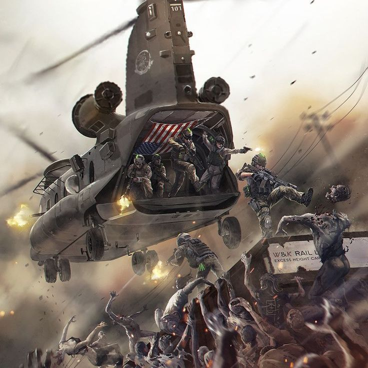

# Wprowadzenie

## Zagłada

### Preludium

Początek epidemii nie był zwykłą zarazą, tylko nieudanym programem biologicznym, którego cele i efekty zostały wypaczone. Mimo świata nad krawędzią ludzie spierają się o to jak to się zaczęło, wielu słyszało i wielu powodach i wielu z nich ma rację bowiem nie było jednego ogniska zapalnego i tylko jednego powodu ale wszystkie rzeczywiście mają jedno źródło - człowieka.

W XXI wieku świat stanął na progu wojny światowej. Mocarstwa szykowały się do skoku sobie do gardła, bo jak uważały trzeba rozstrzygnąć nowy porządek. Paradoksalnym wybawieniem świata stały się wojny proxy. Wielkie mocarstwa zamiast wysyłać swoje główne armie do globalnych starć lub rakiety kontynentalne, oddelegowały te funkcje do swoich mniejszych sojuszników. Nie reagując na niepokorność mniejszych watażków i dyktatorów dali światu przyzwolenie na wykorzystanie siły jako środka do osiągnięcia celów. W ten sposób zaczęły wybuchać łańcuchowo kolejne mniejsze wojny, w których wielkie mocarstwa udawały rolę starszego brata. Każdy mini konflikt stał się laboratorium wojennym. Miało to też inne efekty jak zużycie ogromnej ilości wyposażenia i leków, akurat na moment przed najczarniejszą godziną ludzkości.

Mniejsze państwa nie miały szans z możliwościami mocarstw, dlatego każda umowa o dalszą pomoc od swoich sojuszników była cyrografem. Właśnie z taką propozycją pojawił się przedstawiciel organizacji [DeathNet](../wiki/DeathNet.md). Prowadzili oni projekt, który miał maksymalizować szansę na przeżycie żołnierza. Choć zaczęło się niewinnie, czyli stabilizacji rannych jeszcze na polu bitwy, to bardzo szybko ich projekt eskalował. Ogromna ilość konfliktów dała im nieskończony potencjał badawczy.

Ranny śmiertelnie żołnierz mógł zapaść w letarg centralizujący krążenie krwi, podtrzymywana była aktywność mózgu, a nawet naprawiane uszkodzenia neurologiczne po ciśnieniu powietrza towarzyszące każdej eksplozji. Z perspektywy państwa ranny żołnierz, którym trzeba się zająć może być kosztem, ale utrata jego wiedzy i doświadczenia jest jeszcze gorsza. Mniejsze Państwa szybko zaczęły same zgłaszać się do programu, który stale wprowadzał kolejne możliwości. Zainteresowani wrogowie zaczęli porywać ciała by zbadać tą technologię i opracować nie tylko odpowiedź na nią, ale i własną wersję.

`DeathNet` skupiał się na ratowaniu życia. Udało im się nawet stworzyć biologiczną sieć namierzania. Ciało rannego żołnierza zaczynało emitować specjalne feromony, które mogli łatwiej wyczuć ich kompanii oraz można było je wykrywać specjalnymi czujnikami. Sieć jako taka bardziej tyczyła się żołnierzy, którzy uskrzydleni niewątpliwym przeżyciem zaczęli o wiele skuteczniej walczyć. Wtedy pojawił się pomysł by zwiększyć ich możliwości znoszenia trudnych warunków i zwiększenia siły. Nie bez problemów, ale kolejne etapy projektu się udały za sprawą zgłoszenia się ogromnej ilości chętnych do testów. Byli to okaleczeni weterani, którzy tak bardzo chcieli wrócić w objęcia "sieci", że uwierzyli w uzdrowienie. Ponadto specjalne oddziały nie były super bohaterami, ale ich zmysły zaczęła dorównywać zwierzętom, mieli większą kontrolę nad procesami odpoczynku i wysiłku. `DeathNet` nigdy nie oczekiwał, że zajdzie tak daleko, ale od samego początku wiedział, że pewnego dnia "super żołnierze" mogą zwrócić swoją broń przeciw nim. Dlatego zaoferowany produkt swoim proxy sojusznikom nigdy nie był kompletny.

Dowiedziały się o tym także wrogie mocarstwa. Nie miały one czasu by opracowywać od podstaw własną wersję kiedy ich armie dziesiątkowane były przez napotkane oddziały żołnierzy, którzy nawet po poważnym zranieniu szybko wracali na pole bitwy lub szkolili kolejnych. Stwierdzili, że mogą zrobić tylko jedno, wypaczyć dzieło inżynierii genetycznej. Obrano różne metody dostarczenia kontr środków, ale tylko jeden z nich okazał się przełomem o wiele większym niż spodziewali się sami autorzy.

Stworzyli broń o nazwie `LiveCore`, która uderzała w najgłębsze i najbardziej pierwotne instynkty człowieka. Zadbali o jego przenoszalność poprzez wymianę płynów, a następnie podali go nie swoim żołnierzom, nawet nie walczącym żołnierzom DeathNet'u, ale tym specyficznie rannym żołnierzom. Najpierw przeprowadzili głębokie analizy wywiadowcze. Potrzebowali takich osobników, którzy będą odpowiednio ranni by trafić do szpitala i odpowiednio zdrowi by mogli zawalczyć. Poświęcili wiele tysięcy swoich wojsk by przygotować operację do najdrobniejszego szczegółu.

### Interludium

Kiedy pierwszy zarażony `LiveCore` trafił do szpitala na tyłach, a nie polowego gdzie było wielu z DeathNet'u, wszystko eksplodowało. Już nie ludzie, a bestie wylały się w bazach wojskowych i centrach miast. Skala przemocy, zniszczeń, szybkość rozprzestrzeniania oraz mutowanie wirusa przekroczyła wyobraźnię twórców ze wszystkich stron barykady. Państwa podzieliły się na trzy rodzaje reakcji: te, które bagatelizowały doniesienia zza oceanu; te, które próbowały rachować środki do celu; i te, które były gotowe zrobić absolutnie wszystko by się ocalić. Uruchomiono każdy typ rakiety, broni laserowej, biologicznej, chemicznej oraz jądrowej by stłumić to w ogniskach w których powstały, ale się nie udało. Pozycja człowieka jako gatunku dominującego po raz pierwszy została nie tylko zagrożona, ale walka toczyła się o jakąkolwiek egzystencję w łańcuchu życia.

Wojna przestała być konfliktem proxy, a mocarstwa pogrążane w chaosie własnych ognisk musiały same wysłać każdego żołnierza w pole do brutalnej rzezi. W wielu miejscach cywile stawali się ochotnikami, a w niektórych zmuszano ich do tego. Wbrew powszechnym oczekiwaniom jakoby ludzie upadli z dnia na dzień okazało się przesadzone. Mimo to ludzkość poznała zupełnie nową definicję wojny. Przez całą historię cywilizacji ludzie prowadzili dwa rodzaje wojen: o zwycięstwo lub wzajemne wyniszczenie. W tej wojnie zwycięstwem był oddech, a każdy ranny dołączał do szeregów wroga. Wszystkie strategie i taktyki walki szacujące bilans zysków i strat nie miały sensu. Ludzkość musiała się schować, musiała zejść z podium, musiała oddać koronę jeśli chciała przetrwać, ale tego nie można było tak po prostu zrobić. Dla nowego wroga to było za mało. Parę państw tego spróbowało i całe zostały pochłonięte. Dlatego że istoty określane mianem zombie miały w sobie jakiś cel nieznany ludziom. Autorzy `DeathNet` i `LiveCore` połączyli swe siły by dojść do wniosku, że żaden z ich tworów nie mógł napędzać oddolnie tych bestii. Musiała to być mutacja lub zupełnie nowy twór.

To był pierwszy krok by móc mówić o nadziei bowiem jest to gra, którą ludzkość zna. Bilansem zysków i strat nie było terytorium czy ludzie, a każda kula, ośrodek badawczy czy naukowiec, skrawek informacji czy zdjęcia który umożliwiłby poskładanie puzzli w całość. Rozpoczął się wyścig z czasem bo można było zrzucić kolejną bezsensowną bombę na armię zombie, ale nie tylko przynosiło to mniejszy efekt niż na ludzi, ale po niej przychodziły kolejne i kolejne armie. Będący w posiadaniu `LiveCore` przygotowali kampanię propagandową pasującą do ich filozofii i zaczęli nawet podawać środek swoim obywatelom by zwalczać ogień ogniem by kupić sobie czas. To wywabiło z ukrycia osobniki, które opatrzono mianem `Alpha`. Osobniki zdolne do kierowania innymi zarażonymi. Niektóre były potężne same w sobie, wielkie i silne, niektóre o nadprzyrodzonych zdolnościach, a jeszcze inne niczym nie różniły się od pozostałych bestii ale były sprytne, uczyły się taktyk ludzi. Wtedy ludzkość zrozumiała że nie jest to jeden twór, a każda Alpha mimo że nie dąży do walki z innymi Alpha'mi to jest osobnym bytem z własnymi - Bóg jeden wie jakimi - celami, o ile dalej jest po stronie ludzi. Wszystkie pozostałe środki zostały poświęcone by je odnaleźć, potwierdzić i zniszczyć.

Naukowcy teoretyzowali nad powstaniem Alph, ale jakiekolwiek ziarenka prawdy niesie ze sobą tylko jedna teoria. Próba zduszenia wszystkiego w zarodku poprzez bombardowania i broń biologiczną stworzyły w istocie prawdziwą mutacyjną nieckę w której mogło wylęgać się wszystko. Poświęcono setki tysięcy ludzi by zabić jedną Alpha. Zabito ich setki i nigdy nie spotkano dwóch takich samych. Nie spotkano też groźniejszych osobników niż one. Mimo wielkiej ceny wciąż pozostało mnóstwo zombie.

Homo sapiens chodził po ziemi od 300 tysięcy lat i niemal zmieniło się to w nieco ponad 300 dni.

### Postludium

Ludzkość z defensywy przeszła do partyzantki. Udało im się jednak osiągnąć najważniejsze. Pośród niezliczonych zombie nie było widać więcej osobników Alpha. Im dalej od wojny, tym częściej ludzie doszukiwali się ich w co większych zombie, ale nigdy się to nie potwierdziło.

Ludzie rozpierzchli się szukając miejsca dla siebie w nowym świecie. Samotne wędrówki z czasem doprowadzały do napotkania innych grup lub miejsc dogodnych do życia i obrony. Zawiązywały się bandy i drobne plemiona, które skakały sobie do gardeł o to, co zostało. Niektóre grupy przywdziewały wywracane filozofie starego świata, a inne szyły idee i cele na nowo.

Tak jak ludzie musieli się zaadaptować, zrobiły to też zwierzęta i rośliny. Jedną z największych niespodzianek wojny było to, że wirus nie opanował zwierząt. Mimo to zmieniło je promieniowanie, choroby oraz nowy naturalny wróg z którym wygranie walki o terytorium było bardzo krwawe. Drapieżniki w lasach i wszystkie udomowione zwierzęta okazały się więc bardzo wartościowymi sprzymierzeńcami. Część z nich niestety za sprawą mutacji również zmieniła się w oszalałe bestie.

U niektórych ludzi wciąż można było spotkać cechy rozwodnionego przez pokolenia DeathNet'u, ale pozbawionego spaczeniem wirusa. Z czasem świat zaczął mutować także ludzi pozbawionych modyfikacji genetycznych. Zwiększona siła, percepcja, a z czasem nawet zdolności parapsychiczne. Stworzyło to po równi nowe podziały i sojusze.

Nad ludźmi wisi groza powrotu Alphy, która pokieruje stada na ich domy. Wciąż boją się oni zombie, boją się potworów w lasach, mutantów między nimi i boją się innych ludzi. To strach był królem nowego świata, a jego ludzie zanim zetrą się z nadnaturalną siłą będą musieli przede wszystkim poradzić sobie ze swoimi najprostszymi odczuciami. Czy będą mieli odwagę być ludźmi czy wybiorą to co konieczne...